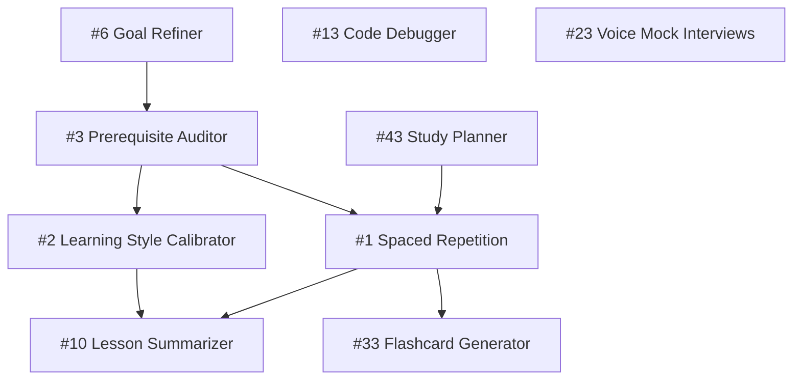

# P0 — Critical: Implementation Plan

> **8 features** · Ship in next 2 sprints · ~120 engineering hours
> These are the core differentiators that define RoadmapAI's value proposition. Without them, the product is a static roadmap generator. With them, it becomes an adaptive learning engine.

---

## Feature Inventory

| # | Feature | Category | Est. Hours |
|---|---|---|---|
| 1 | AI Adaptive Spaced Repetition Engine | Personalization | 20 |
| 2 | AI Learning Style Calibrator | Personalization | 15 |
| 3 | AI Prerequisite Auditor & Gap-Filler | Personalization | 18 |
| 6 | AI Goal Refiner & Scope Advisor | Personalization | 10 |
| 10 | AI Lesson Summarizer & Cheat-Sheet Generator | Content | 12 |
| 13 | AI Inline Code Debugger | Developer Tools | 15 |
| 23 | AI Voice-Enabled Mock Interviews | Career Intel | 18 |
| 33 | AI Flashcard Generator (Anki-Style) | Content | 12 |
| 43 | AI Study Planner & Calendar Optimizer | Scheduling | — |

> [!NOTE]
> Feature 43 (Study Planner) appears in Phase A of the timeline but is listed as the 9th feature. It is included here as a bonus P0 item since it directly impacts retention.

---

## Dependency Graph



**Build order**: 6 → 3 → 2 → 1 → 33 → 10 → 13 → 23 → 43

---

## Feature 1: AI Adaptive Spaced Repetition Engine

### Problem
Users complete lessons but forget content within 2–3 weeks. There is no mechanism to schedule reviews at scientifically optimal intervals.

### Technical Design

#### Data Model
```typescript
// Firestore: users/{uid}/sr_schedule/{lessonId}
interface SRScheduleEntry {
  lessonId: string
  roadmapId: string
  easeFactor: number       // SM-2: starts at 2.5
  interval: number         // days until next review
  repetitions: number      // successful consecutive recalls
  nextReviewDate: string   // ISO 8601
  lastReviewDate: string
  lastScore: number        // 0–5 scale
}
```

#### Algorithm: Modified SM-2
```
if score >= 3:
  if repetitions == 0: interval = 1
  elif repetitions == 1: interval = 6
  else: interval = round(interval * easeFactor)
  repetitions += 1
  easeFactor = max(1.3, easeFactor + 0.1 - (5 - score) * (0.08 + (5 - score) * 0.02))
else:
  repetitions = 0
  interval = 1
```

#### Architecture
1. **Trigger**: When a user marks a lesson complete → create `SRScheduleEntry` with `interval=1`, `nextReviewDate=tomorrow`.
2. **Daily check**: Firebase Cloud Function runs at 08:00 UTC → queries all entries where `nextReviewDate <= today` → pushes to `users/{uid}/review_queue`.
3. **Review UI**: New `/review` page shows a queue of lessons due for review. Each shows a mini-quiz (3–5 questions generated by Gemini). User self-rates 0–5.
4. **Reschedule**: After rating, recalculate `interval` and `nextReviewDate` using SM-2.

#### Files to Create/Modify
| Action | Path | Purpose |
|---|---|---|
| NEW | `frontend/app/review/page.tsx` | Review queue UI |
| NEW | `frontend/components/ReviewCard.tsx` | Individual flashcard review component |
| NEW | `frontend/lib/spaced-repetition.ts` | SM-2 algorithm implementation |
| MODIFY | `frontend/components/ChapterList.tsx` | Add "Schedule Review" action to completed lessons |
| NEW | `backend/functions/daily_review_check.py` | Cloud Function for daily queue generation |
| MODIFY | `frontend/types/index.ts` | Add `SRScheduleEntry` type |

#### API Endpoints
```
POST /api/sr/schedule       — Create/update a schedule entry after review
GET  /api/sr/queue          — Get today's review queue
POST /api/sr/generate-quiz  — Generate mini-quiz for a lesson (Gemini)
```

#### UI Spec
- Dashboard: "3 lessons due for review" banner with amber accent
- Review page: Full-screen card-flip interface. Front = question, Back = answer + self-rating (1–5 buttons)
- Animation: `framer-motion` card flip with `rotateY` transform

#### Testing
- Unit: SM-2 algorithm produces correct intervals for all score paths
- Integration: Cloud Function correctly queries and populates review queue
- E2E: Complete lesson → verify review appears next day → rate → verify rescheduled

---

## Feature 2: AI Learning Style Calibrator

### Problem
All users receive the same resource types regardless of whether they learn better from videos, articles, or interactive content.

### Technical Design

#### Data Model
```typescript
// Firestore: users/{uid}/learning_profile
interface LearningProfile {
  userId: string
  modality_scores: {
    video: number      // 0.0–1.0 affinity
    article: number
    interactive: number
    audio: number
  }
  total_engagements: number
  calibration_confidence: number  // 0.0–1.0, increases with data
  last_updated: string
}
```

#### Algorithm: Thompson Sampling (Multi-Armed Bandit)
```
For each resource type r:
  alpha_r = successes + 1  (lesson completed after engaging resource type)
  beta_r = failures + 1    (lesson NOT completed after engagement)
  sample_r = Beta(alpha_r, beta_r)
  
Rank resource types by sample_r descending.
Weight future resource recommendations accordingly.
```

#### Architecture
1. **Tracking**: When user clicks a resource link → log `{type, lessonId, timestamp}`. When user completes the parent lesson → mark all engaged resources as "successful."
2. **Scoring**: After every 5 completions, recalculate `modality_scores` using Thompson sampling.
3. **Application**: When generating roadmaps or showing resources, weight types by `modality_scores`. If `video: 0.8, article: 0.3`, show 3 videos for every 1 article.
4. **Calibration UI**: Settings page shows a visual breakdown of detected learning style with manual override toggles.

#### Files to Create/Modify
| Action | Path | Purpose |
|---|---|---|
| NEW | `frontend/lib/learning-calibrator.ts` | Thompson sampling engine |
| MODIFY | `frontend/components/ResourcePanel.tsx` | Sort resources by modality affinity |
| MODIFY | `frontend/app/roadmap/[id]/page.tsx` | Track resource engagement events |
| NEW | `frontend/components/LearningStyleCard.tsx` | Visual breakdown in dashboard/settings |
| MODIFY | `frontend/types/index.ts` | Add `LearningProfile` type |

#### Testing
- Unit: Thompson sampling converges to correct modality after 50 simulated interactions
- Visual: Dashboard card shows pie chart of learning style breakdown

---

## Feature 3: AI Prerequisite Auditor & Gap-Filler

### Problem
Users start advanced roadmaps without necessary prerequisites, leading to frustration and dropouts.

### Technical Design

#### Skill Taxonomy Graph
```typescript
// Stored in Firestore: skill_taxonomy/{skillId}
interface SkillNode {
  id: string
  name: string              // e.g. "Linear Algebra"
  category: string          // e.g. "Mathematics"
  prerequisites: string[]   // IDs of prerequisite skills
  embedding: number[]       // 768-dim vector from Gemini Embeddings
}
```

#### Architecture
1. **Skill Extraction**: When a new roadmap is generated, Gemini extracts the core skills from the goal + phases into a structured list.
2. **User Skill Profile**: Maintain a running set of all skills the user has covered across all completed roadmaps.
3. **Gap Detection**: Before generating a new roadmap, compare required prerequisites against the user's skill profile. Flag missing ones.
4. **Bridge Module Generation**: For each gap, call Gemini to generate a mini-module (2–5 lessons) that covers the prerequisite at the appropriate depth.
5. **UI**: Modal before roadmap generation: "We detected you may need these prerequisites: [Linear Algebra, Probability]. Generate bridge modules?"

#### Gemini Prompt Template
```
You are a curriculum designer. The user wants to learn: {goal}.
This requires the following prerequisite skills: {required_skills}.
The user has already completed: {completed_skills}.
Missing prerequisites: {gap_skills}.

For each missing prerequisite, generate a bridge module with:
- Module title
- 2–5 lessons with titles, descriptions, durations
- Estimated total time

Output as JSON matching the Phase schema.
```

#### Files to Create/Modify
| Action | Path | Purpose |
|---|---|---|
| NEW | `backend/app/skills/taxonomy.py` | Skill taxonomy CRUD + embedding search |
| NEW | `backend/app/skills/gap_detector.py` | Prerequisite gap detection logic |
| MODIFY | `backend/app/roadmap/generator.py` | Inject gap analysis before generation |
| NEW | `frontend/components/PrerequisiteModal.tsx` | Gap analysis results + bridge module offer |
| MODIFY | `frontend/app/generate/page.tsx` | Trigger prerequisite check before generation |
| NEW | `frontend/types/skills.ts` | Skill taxonomy types |

---

## Feature 6: AI Goal Refiner & Scope Advisor

### Problem
Users type vague goals like "learn coding" which produce unfocused roadmaps.

### Technical Design

#### Flow
```
User types: "learn coding"
  → Gemini multi-turn chat:
    AI: "What kind of coding? Web, mobile, data science, embedded?"
    User: "Web"
    AI: "Frontend, backend, or full-stack?"
    User: "Frontend"
    AI: "Any specific framework? React, Vue, Angular, or undecided?"
    User: "React"
    AI: "What's your timeline? Are you learning for a career switch, hobby, or upgrading existing skills?"
    User: "Career switch, 6 months"
  → Refined goal: "Learn frontend React development for career transition in 6 months"
  → Scope classification: { specificity: 'high', feasibility: 'achievable', timeline: 'moderate' }
```

#### Architecture
1. **Pre-generation step**: After user types a goal, analyze it with Gemini for specificity score (0–1).
2. **If specificity < 0.6**: Launch a guided multi-turn conversation (max 5 turns) to narrow scope.
3. **Scope validation**: Final refined goal is scored for feasibility given the user's stated skill level and daily hours.
4. **Output**: Refined goal string + structured metadata → feed into existing roadmap generator.

#### UI
- Inline chat bubbles below the goal input field
- Each AI question is a clickable quick-reply chip OR free-text input
- "Skip refinement" button for experienced users

#### Files to Create/Modify
| Action | Path | Purpose |
|---|---|---|
| NEW | `frontend/components/GoalRefiner.tsx` | Multi-turn chat UI for goal refinement |
| MODIFY | `frontend/app/generate/page.tsx` | Integrate refiner before roadmap generation |
| MODIFY | `backend/app/roadmap/generator.py` | Accept refined goal + metadata |
| NEW | `backend/app/roadmap/goal_refiner.py` | Gemini multi-turn goal analysis |

---

## Feature 10: AI Lesson Summarizer & Cheat-Sheet Generator

### Problem
After completing a lesson, users have no quick-reference material for review.

### Technical Design

#### Architecture
1. **Trigger**: "Generate Summary" button on each completed lesson in `LessonWorkspace`.
2. **Gemini call**: Send lesson title, description, content, and practice exercises → receive structured summary.
3. **Output format**:
   ```typescript
   interface LessonSummary {
     title: string
     key_concepts: string[]          // 5–8 bullet points
     code_snippets: CodeBlock[]      // key code examples
     common_mistakes: string[]       // 3–5 pitfalls
     quick_reference: string         // markdown cheat-sheet
     flashcard_pairs: { q: string, a: string }[]
   }
   ```
4. **Storage**: Cache in `localStorage` with key `summary_{lessonId}`. Optionally persist to Firestore.
5. **Export**: Markdown download, PDF print (reuse existing PDF export infra).

#### Files to Create/Modify
| Action | Path | Purpose |
|---|---|---|
| NEW | `frontend/components/LessonSummary.tsx` | Summary display with tabs (concepts, code, mistakes) |
| MODIFY | `frontend/components/LessonWorkspace.tsx` | Add "Generate Summary" button |
| MODIFY | `backend/app/roadmap/generator.py` | Add `/api/lesson/summarize` endpoint |
| NEW | `frontend/lib/summary-cache.ts` | localStorage caching logic |

---

## Feature 13: AI Inline Code Debugger

### Problem
Students hit errors in the Code Playground and don't know what went wrong. They leave the platform to search for answers.

### Technical Design

#### Architecture
1. **Error interception**: Monaco editor's `onDidChangeModelDecorations` event captures diagnostic markers (syntax errors, type errors).
2. **Runtime errors**: Sandboxed execution (WebAssembly / iframe) captures `console.error`, uncaught exceptions, and assertion failures.
3. **Gemini analysis**: Send the error message + surrounding 20 lines of code + lesson context → receive structured debug explanation.
4. **Inline rendering**: Show the explanation as an inline decoration below the error line (similar to VS Code's error lens).

#### Gemini Prompt
```
The student is working on a {language} exercise titled "{lesson_title}".
They encountered this error:
```
{error_message}
```

Here is their code (error on line {line_number}):
```{language}
{code_with_line_numbers}
```

Explain:
1. What the error means in plain English
2. The exact cause in their code
3. How to fix it (with corrected code snippet)
4. A "why this happens" conceptual explanation

Format as JSON: { explanation, cause, fix, concept }
```

#### Files to Create/Modify
| Action | Path | Purpose |
|---|---|---|
| NEW | `frontend/components/CodeDebugger.tsx` | Inline error explanation overlay |
| MODIFY | `frontend/components/LessonWorkspace.tsx` | Integrate debugger with Monaco editor |
| NEW | `backend/app/code/debugger.py` | Gemini debug analysis endpoint |
| NEW | `frontend/lib/error-interceptor.ts` | Runtime error capture utilities |

---

## Feature 23: AI Voice-Enabled Mock Interviews

### Problem
Text-based mock interviews don't train verbal delivery, which is the actual format of real interviews.

### Technical Design

#### Architecture
1. **Speech-to-Text**: Web Speech API (`SpeechRecognition`) for real-time transcription. Fallback: Gemini multimodal audio input.
2. **Text-to-Speech**: Web Speech API (`SpeechSynthesis`) for AI interviewer voice. Premium: Google Cloud TTS.
3. **Interview flow**:
   - AI asks a question (displayed + spoken)
   - User responds verbally (live transcription shown)
   - User clicks "Submit Answer" (or 60s auto-submit)
   - Gemini evaluates: technical accuracy, completeness, verbal clarity, filler word count
   - Score card: Technical (0–10), Communication (0–10), Confidence (0–10)
4. **Session recording**: Optional: store transcript + scores in Firestore for progress tracking.

#### Scoring Rubric
```typescript
interface InterviewScore {
  technical_accuracy: number    // 0–10
  completeness: number          // 0–10
  communication_clarity: number // 0–10
  filler_word_count: number     // absolute count
  filler_words_detected: string[]
  overall_grade: 'A' | 'B' | 'C' | 'D' | 'F'
  feedback: string
  improved_answer: string       // AI's model answer
}
```

#### Files to Create/Modify
| Action | Path | Purpose |
|---|---|---|
| NEW | `frontend/app/interview/page.tsx` | Voice interview session page |
| NEW | `frontend/components/VoiceInterview.tsx` | Core voice interview component |
| NEW | `frontend/components/InterviewScoreCard.tsx` | Score display after answer |
| NEW | `frontend/lib/speech.ts` | Web Speech API wrappers |
| NEW | `backend/app/interview/evaluator.py` | Gemini interview evaluation |
| MODIFY | `frontend/types/index.ts` | Add interview types |

---

## Feature 33: AI Flashcard Generator (Anki-Style)

### Problem
Active recall is the most effective study technique but users don't create their own flashcards.

### Technical Design

#### Data Model
```typescript
// Firestore: users/{uid}/flashcard_decks/{deckId}
interface FlashcardDeck {
  id: string
  roadmapId: string
  lessonId: string
  title: string
  cards: Flashcard[]
  created_at: string
}

interface Flashcard {
  id: string
  front: string       // question
  back: string        // answer
  type: 'concept' | 'code' | 'definition' | 'comparison'
  difficulty: 'easy' | 'medium' | 'hard'
  sr_data?: SRScheduleEntry  // links to spaced repetition
}
```

#### Architecture
1. **Generation**: "Generate Flashcards" button on completed lessons → Gemini extracts 8–15 Q&A pairs.
2. **UI**: Swipeable card stack (Tinder-style). Swipe right = "I knew this", swipe left = "Review again".
3. **Integration with Feature 1**: Each flashcard's SR data feeds into the spaced repetition engine.
4. **Deck management**: `/flashcards` page shows all decks, filterable by roadmap. Merge decks for cross-topic review.

#### Gemini Prompt
```
Generate 10 flashcards for the lesson "{lesson_title}".
Lesson content: {lesson_description}
Key topics: {key_topics}

For each card, provide:
- front: A clear question testing recall of a single concept
- back: A concise, accurate answer (2–3 sentences max)
- type: one of [concept, code, definition, comparison]
- difficulty: one of [easy, medium, hard]

Output as JSON array of { front, back, type, difficulty }.
```

#### Files to Create/Modify
| Action | Path | Purpose |
|---|---|---|
| NEW | `frontend/app/flashcards/page.tsx` | Flashcard deck browser |
| NEW | `frontend/components/FlashcardStack.tsx` | Swipeable card stack UI |
| NEW | `frontend/components/FlashcardCard.tsx` | Individual card with flip animation |
| MODIFY | `frontend/components/LessonWorkspace.tsx` | Add "Generate Flashcards" button |
| NEW | `backend/app/flashcards/generator.py` | Gemini flashcard generation |
| MODIFY | `frontend/types/index.ts` | Add flashcard types |

---

## Feature 43: AI Study Planner & Calendar Optimizer

### Problem
Users set ambitious timelines but fall behind, get demoralized, and abandon roadmaps.

### Technical Design

#### Architecture
1. **Velocity tracking**: Calculate rolling 7-day and 30-day lesson completion velocity.
2. **Deadline adjustment**: If actual velocity < target velocity for 2+ consecutive weeks → surface a suggestion: "Adjust timeline from 3 months to 4 months?"
3. **Calendar export**: Generate `.ics` file with daily/weekly study blocks based on `daily_hours` setting.
4. **Google Calendar API** (optional): Direct sync with 2-way updates.

#### Adjustment Algorithm
```
target_velocity = total_remaining_lessons / weeks_remaining
actual_velocity = lessons_completed_last_14_days / 2

if actual_velocity < target_velocity * 0.7:
  suggested_extension_weeks = ceil(remaining_lessons / actual_velocity) - weeks_remaining
  surface_suggestion("Extend by {suggested_extension_weeks} weeks?")

if actual_velocity > target_velocity * 1.3:
  surface_suggestion("You're ahead! Finish {weeks_early} weeks early at this pace.")
```

#### Files to Create/Modify
| Action | Path | Purpose |
|---|---|---|
| NEW | `frontend/lib/study-planner.ts` | Velocity analysis + timeline suggestions |
| NEW | `frontend/components/StudyPlannerBanner.tsx` | Dashboard banner with adjustment CTA |
| NEW | `frontend/lib/calendar-export.ts` | `.ics` file generation |
| MODIFY | `frontend/app/dashboard/page.tsx` | Integrate planner banner |

---

## Sprint Plan

### Sprint 1 (Weeks 1–2): Foundation
- [ ] Feature 6: Goal Refiner — multi-turn chat UI + backend endpoint
- [ ] Feature 3: Prerequisite Auditor — skill taxonomy schema + gap detection
- [ ] Shared: Type definitions, Gemini API wrapper standardization

### Sprint 2 (Weeks 3–4): Core Intelligence
- [ ] Feature 1: Spaced Repetition — SM-2 algorithm + review page + Cloud Function
- [ ] Feature 2: Learning Style Calibrator — tracking events + Thompson sampling
- [ ] Feature 33: Flashcard Generator — Gemini generation + card stack UI

### Sprint 3 (Weeks 5–6): Content & Code Tools
- [ ] Feature 10: Lesson Summarizer — generation + caching + export
- [ ] Feature 13: Code Debugger — Monaco integration + inline explanations
- [ ] Feature 43: Study Planner — velocity tracking + calendar export

### Sprint 4 (Weeks 7–8): Interview & Polish
- [ ] Feature 23: Voice Mock Interviews — Web Speech API + evaluation pipeline
- [ ] Integration testing across all P0 features
- [ ] Performance optimization, error handling, edge cases

---

## Risk Register

| Risk | Probability | Impact | Mitigation |
|---|---|---|---|
| Gemini API rate limits during heavy usage | Medium | High | Implement response caching, batch requests, fallback to cached summaries |
| Web Speech API browser compatibility | Medium | Medium | Feature detection + graceful fallback to text-only mode |
| SM-2 algorithm cold-start (no data yet) | Low | Medium | Default to fixed 1-3-7-14 day intervals until sufficient data |
| Skill taxonomy maintenance overhead | Medium | Low | Auto-generate taxonomy from roadmap content, manual curation quarterly |
| Flashcard quality variance from Gemini | Low | Medium | Post-generation validation pipeline + user "flag bad card" button |

---

## Success Metrics

| Feature | KPI | Target |
|---|---|---|
| Spaced Repetition | 7-day lesson retention rate | > 80% (vs. ~40% baseline) |
| Learning Style Calibrator | Resource engagement rate | +25% click-through |
| Prerequisite Auditor | Roadmap abandonment rate | -30% reduction |
| Goal Refiner | Roadmap specificity score | > 0.8 average |
| Lesson Summarizer | Summary generation usage | > 60% of completed lessons |
| Code Debugger | Time-to-resolution for errors | -50% reduction |
| Voice Interviews | Interview prep session count | > 3 per user per month |
| Flashcard Generator | Daily active review users | > 40% of DAU |
| Study Planner | Timeline adjustment acceptance | > 50% when suggested |
