# P1 — High Priority: Implementation Plan

> **14 features** · Ship in 3–6 months · ~180 engineering hours
> These features add substantial depth to the learning experience — code intelligence, career tools, and smart content delivery. They assume all P0 features are operational.

---

## Feature Inventory

| # | Feature | Category | Est. Hours | Dependencies |
|---|---|---|---|---|
| 4 | AI Cognitive Load Monitor | Personalization | 12 | — |
| 5 | AI Socratic Method Toggle | Personalization | 8 | AIMentor component |
| 9 | AI Translation & Cultural Localization | Personalization | 15 | — |
| 12 | AI Difficulty Auto-Scaler | Personalization | 14 | P0 #1 (SR data) |
| 14 | AI Code Explainer | Developer Tools | 10 | LessonWorkspace |
| 15 | AI Automated Code Challenge Grader | Developer Tools | 16 | P0 #13 (Debugger) |
| 19 | AI API Sandbox Generator | Developer Tools | 14 | — |
| 24 | AI Resume Auditor & Roadmap Matcher | Career Intel | 12 | P0 #3 (Skill Taxonomy) |
| 26 | AI Behavioral Interview Coach (STAR) | Career Intel | 10 | P0 #23 (Interview infra) |
| 27 | AI Portfolio Project Advisor | Career Intel | 8 | — |
| 35 | AI Video Content Summarizer | Content | 10 | — |
| 38 | AI Resource Relevance Scorer | Content | 10 | P0 #2 (Calibrator) |
| 39 | AI Smart Search & Semantic Finder | Content | 15 | — |
| 45 | AI Daily Micro-Quiz Recall Test | Scheduling | 12 | P0 #1 (SR Engine) |
| 47 | AI Weekly Progress Review & Coach Report | Scheduling | 10 | Dashboard analytics |

---

## Dependency Graph

```mermaid
graph TD
    P0_1["P0: Spaced Repetition"] --> F12["#12 Difficulty Scaler"]
    P0_1 --> F45["#45 Daily Micro-Quiz"]
    P0_2["P0: Learning Calibrator"] --> F38["#38 Resource Scorer"]
    P0_3["P0: Prerequisite Auditor"] --> F24["#24 Resume Auditor"]
    P0_13["P0: Code Debugger"] --> F15["#15 Code Grader"]
    P0_23["P0: Voice Interviews"] --> F26["#26 STAR Coach"]
    F4["#4 Cognitive Load"] 
    F5["#5 Socratic Toggle"]
    F9["#9 Translation"]
    F14["#14 Code Explainer"]
    F19["#19 API Sandbox"]
    F27["#27 Portfolio Advisor"]
    F35["#35 Video Summarizer"]
    F39["#39 Smart Search"]
    F47["#47 Weekly Review"]
```



---

## Feature 4: AI Cognitive Load Monitor

### Problem
Students study until they're exhausted, leading to burnout and decreased retention. No system detects fatigue.

### Technical Design

#### Signal Collection (Client-Side)
```typescript
interface CognitiveLoadSignals {
  consecutiveQuizFailures: number
  avgTimePerQuestion_ms: number    // sudden spikes = fatigue
  clickVelocity: number            // rapid unfocused clicking
  pageDwellTime_ms: number         // abnormally long = confusion
  scrollBounceCount: number        // scrolling up/down without reading
  sessionDuration_ms: number
  errorRate: number                // code playground errors per minute
}
```

#### Detection Heuristic (No ML Required Initially)
```typescript
function detectOverload(signals: CognitiveLoadSignals): 'normal' | 'warning' | 'overloaded' {
  let score = 0
  if (signals.consecutiveQuizFailures >= 3) score += 3
  if (signals.sessionDuration_ms > 90 * 60 * 1000) score += 2  // 90 min
  if (signals.avgTimePerQuestion_ms > 45000) score += 1         // 45 sec/question
  if (signals.clickVelocity > 5) score += 2                     // 5+ clicks/sec
  if (signals.errorRate > 3) score += 1                         // 3+ errors/min
  
  if (score >= 5) return 'overloaded'
  if (score >= 3) return 'warning'
  return 'normal'
}
```

#### UI Response
- **Warning**: Subtle toast: "You've been studying for 90 minutes. Consider a short break? 🧘"
- **Overloaded**: Modal overlay: "We noticed you might be hitting a wall. Here are some options:" → [Take a 5-min break] [Switch to easier content] [Review flashcards instead] [Continue anyway]
- **Break timer**: Optional Pomodoro timer with ambient sound

#### Files to Create/Modify
| Action | Path | Purpose |
|---|---|---|
| NEW | `frontend/lib/cognitive-load.ts` | Signal collection + detection heuristic |
| NEW | `frontend/components/CognitiveLoadMonitor.tsx` | Wrapper component that tracks signals |
| NEW | `frontend/components/BreakSuggestion.tsx` | Break recommendation modal |
| MODIFY | `frontend/components/LessonWorkspace.tsx` | Wrap with CognitiveLoadMonitor |
| MODIFY | `frontend/app/roadmap/[id]/page.tsx` | Mount monitor at page level |

---

## Feature 5: AI Socratic Method Toggle

### Problem
The AI Mentor gives direct answers, which doesn't develop deep reasoning skills.

### Technical Design

#### Architecture
- **Toggle**: Switch in AIMentor header: "Direct Answers ↔ Socratic Mode"
- **Implementation**: Swap system prompt based on toggle state
- **Socratic system prompt**:
```
You are a Socratic tutor. NEVER give direct answers.
Instead:
1. Ask a clarifying question about what the student already knows
2. Point them toward the right direction with a leading hint
3. If they're stuck after 3 exchanges, provide a partial answer with a follow-up question
4. Only give the full answer if they explicitly say "just tell me"

Rules:
- Maximum 2 questions per response
- Always validate their thinking before correcting
- Use phrases like "What do you think would happen if..." and "Can you recall..."
```

#### Files to Create/Modify
| Action | Path | Purpose |
|---|---|---|
| MODIFY | `frontend/components/AIMentor.tsx` | Add toggle switch + prompt switching logic |
| NEW | `frontend/lib/mentor-prompts.ts` | Centralized system prompts (direct, socratic) |

---

## Feature 9: AI Translation & Cultural Localization

### Technical Design

#### Architecture
1. **Language selector**: Dropdown in Navbar and Settings → stores `preferred_language` in user profile.
2. **Translation layer**: Wrap all AI-generated content through a translation function before rendering.
3. **Technical term preservation**: Maintain a glossary of terms that should NOT be translated (e.g., "API", "REST", "Git").
4. **Scope**: Translate lesson descriptions, AI mentor responses, quiz questions, and summaries. DO NOT translate code.

#### Translation Pipeline
```typescript
async function translateContent(content: string, targetLang: string): Promise<string> {
  if (targetLang === 'en') return content
  
  const response = await gemini.generate({
    prompt: `Translate the following educational content to ${targetLang}.
             Preserve ALL technical terms in English (e.g., API, REST, Git, React).
             Preserve all code blocks unchanged.
             Maintain markdown formatting.
             
             Content: ${content}`,
    temperature: 0.1  // low for accuracy
  })
  return response.text
}
```

#### Supported Languages (Initial)
Hindi, Spanish, Portuguese, French, German, Japanese, Korean, Chinese (Simplified), Arabic, Russian

#### Files to Create/Modify
| Action | Path | Purpose |
|---|---|---|
| NEW | `frontend/lib/translation.ts` | Translation pipeline + caching |
| NEW | `frontend/components/LanguageSelector.tsx` | Language picker dropdown |
| MODIFY | `frontend/components/Navbar.tsx` | Add language selector |
| MODIFY | `frontend/store/index.ts` | Add `preferredLanguage` to store |

---

## Feature 12: AI Difficulty Auto-Scaler

### Technical Design

#### Item Response Theory (IRT) Model
```typescript
interface UserAbility {
  theta: number           // ability parameter, starts at 0.0
  standardError: number   // decreases with more data
  lastUpdated: string
}

interface QuestionItem {
  id: string
  difficulty: number      // b parameter: -3 to +3
  discrimination: number  // a parameter: 0.5 to 2.5
}

// Probability of correct answer:
// P(correct) = 1 / (1 + exp(-a * (theta - b)))
```

#### Architecture
1. **Quiz results feed IRT**: Each quiz answer updates `theta` using maximum likelihood estimation.
2. **Adaptive question selection**: Next question targets P(correct) ≈ 0.5–0.7 for optimal learning.
3. **Content scaling**: If `theta > phase_difficulty`, suggest skipping to next phase. If `theta < phase_difficulty`, inject remedial content.
4. **UI**: "Your skill level: Intermediate (3.2/5.0)" badge on phase headers.

#### Files to Create/Modify
| Action | Path | Purpose |
|---|---|---|
| NEW | `frontend/lib/irt-model.ts` | IRT calculations + ability estimation |
| NEW | `backend/app/quiz/adaptive.py` | Adaptive question selection endpoint |
| MODIFY | `frontend/components/ChapterList.tsx` | Show skill level badge per phase |
| MODIFY | `frontend/types/index.ts` | Add `UserAbility`, `QuestionItem` types |

---

## Feature 14: AI Code Explainer

### Technical Design

#### Interaction Model
1. User selects code in Monaco editor → floating "Explain" button appears
2. Click → sends selected code + surrounding context + lesson info to Gemini
3. Response rendered as a slide-in panel with line-by-line annotations

#### Response Schema
```typescript
interface CodeExplanation {
  summary: string                    // 1-sentence overview
  line_annotations: {
    line_number: number
    explanation: string
  }[]
  concepts_used: string[]            // ["closures", "async/await"]
  complexity: string                 // "O(n log n)"
  plain_english: string              // full natural language walkthrough
}
```

#### Files to Create/Modify
| Action | Path | Purpose |
|---|---|---|
| NEW | `frontend/components/CodeExplainer.tsx` | Explanation panel UI |
| MODIFY | `frontend/components/LessonWorkspace.tsx` | Add selection → explain flow |
| NEW | `backend/app/code/explainer.py` | Gemini code explanation endpoint |

---

## Feature 15: AI Automated Code Challenge Grader

### Technical Design

#### Architecture
1. **Test generation**: When a coding challenge starts, Gemini generates 5–10 test cases including edge cases.
2. **Execution**: User code is sandboxed in a Web Worker (or WebAssembly for compiled langs).
3. **Comparison**: Actual output vs. expected output → pass/fail per test case.
4. **Feedback**: For failing tests, show input → expected → actual + Gemini explanation of the failure.
5. **Scoring**: Percentage of tests passed + time complexity analysis.

#### Test Case Schema
```typescript
interface TestCase {
  id: string
  input: string
  expected_output: string
  description: string           // "Empty array input"
  is_edge_case: boolean
  is_hidden: boolean            // revealed after submission
}

interface GradeResult {
  passed: number
  total: number
  time_complexity: string
  space_complexity: string
  test_results: {
    test_id: string
    passed: boolean
    actual_output: string
    execution_time_ms: number
  }[]
  feedback: string
}
```

#### Files to Create/Modify
| Action | Path | Purpose |
|---|---|---|
| NEW | `frontend/components/CodeGrader.tsx` | Test results UI with pass/fail indicators |
| NEW | `frontend/lib/code-sandbox.ts` | Web Worker sandboxed execution |
| NEW | `backend/app/code/grader.py` | Test case generation + grading |
| MODIFY | `frontend/components/LessonWorkspace.tsx` | Integrate grading into code challenges |

---

## Feature 19: AI API Sandbox Generator

### Technical Design

#### Architecture
1. **Schema generation**: Based on lesson content, Gemini generates REST API schemas with typed endpoints.
2. **Mock server**: MSW (Mock Service Worker) intercepts fetch requests in-browser, returning generated mock data.
3. **Typed contracts**: Generated TypeScript interfaces for request/response shapes.
4. **Auto-start**: When a lesson involves API work, the sandbox auto-activates with lesson-relevant endpoints.

#### Generated Schema Example
```typescript
// Auto-generated for "E-Commerce Product List" lesson
const mockEndpoints = [
  {
    method: 'GET',
    path: '/api/products',
    response: { products: [...], total: 50, page: 1 },
    schema: 'Product[]'
  },
  {
    method: 'GET',
    path: '/api/products/:id',
    response: { id: '1', name: 'Widget', price: 29.99 },
    schema: 'Product'
  },
  {
    method: 'POST',
    path: '/api/cart',
    body_schema: '{ productId: string, quantity: number }',
    response: { success: true, cartId: 'abc123' }
  }
]
```

#### Files to Create/Modify
| Action | Path | Purpose |
|---|---|---|
| NEW | `frontend/lib/api-sandbox.ts` | MSW setup + dynamic handler registration |
| NEW | `frontend/components/APISandboxPanel.tsx` | UI showing available endpoints + schemas |
| NEW | `backend/app/code/sandbox-generator.py` | Gemini API schema generation |
| MODIFY | `frontend/components/LessonWorkspace.tsx` | Auto-activate sandbox for API lessons |

---

## Feature 24: AI Resume Auditor & Roadmap Matcher

### Technical Design

#### Architecture
1. **Upload**: User uploads resume (PDF/DOCX) → extract text using `pdf-parse` or Gemini document API.
2. **Skill extraction**: Gemini extracts skills, experience, and technologies from resume text.
3. **Job description input**: User pastes target job description → Gemini extracts required skills.
4. **Gap analysis**: Compare resume skills vs. JD requirements → produce a structured gap report.
5. **Bridge roadmap**: For each gap, generate a mini-roadmap module (reuses P0 Feature 3 infrastructure).

#### Gap Report Schema
```typescript
interface ResumeGapReport {
  resume_skills: string[]
  required_skills: string[]
  matched_skills: string[]       // skills the user already has
  missing_skills: string[]       // skills to acquire
  match_percentage: number       // 0–100
  bridge_modules: Phase[]        // generated mini-roadmaps for gaps
  estimated_prep_time_weeks: number
}
```

#### Files to Create/Modify
| Action | Path | Purpose |
|---|---|---|
| NEW | `frontend/app/resume/page.tsx` | Resume audit page |
| NEW | `frontend/components/ResumeUploader.tsx` | File upload + text extraction |
| NEW | `frontend/components/GapReport.tsx` | Visual gap analysis display |
| NEW | `backend/app/career/resume_auditor.py` | Resume parsing + gap analysis |
| MODIFY | `frontend/components/Navbar.tsx` | Add "Resume" nav item |

---

## Feature 26: AI Behavioral Interview Coach (STAR Method)

### Technical Design

#### Architecture
Extends P0 Feature 23's interview infrastructure with behavioral-specific prompts.

1. **Question bank**: 50+ behavioral questions categorized by theme (leadership, conflict, failure, teamwork).
2. **STAR scoring**: Gemini evaluates each response component:
   - **Situation**: Did they set the context clearly? (0–3)
   - **Task**: Did they define their specific responsibility? (0–3)
   - **Action**: Did they describe concrete steps taken? (0–3)
   - **Result**: Did they quantify the outcome? (0–3)
3. **Follow-up questions**: If a component scores < 2, AI asks a targeted follow-up.

#### Files to Create/Modify
| Action | Path | Purpose |
|---|---|---|
| NEW | `frontend/components/STARInterview.tsx` | STAR-specific interview UI with component scoring |
| NEW | `frontend/lib/star-questions.ts` | Behavioral question bank |
| NEW | `backend/app/interview/star_evaluator.py` | STAR framework scoring |
| MODIFY | `frontend/app/interview/page.tsx` | Add "Behavioral" mode tab |

---

## Feature 27: AI Portfolio Project Advisor

### Technical Design

#### Architecture
1. **Context gathering**: Extract technologies from completed roadmap phases.
2. **Novelty scoring**: Gemini generates 5 project ideas, each scored for uniqueness vs. common projects (todo apps, weather apps, etc.).
3. **Output**: Each project includes title, description, tech stack, estimated hours, and a "Why this stands out" section.

#### Files to Create/Modify
| Action | Path | Purpose |
|---|---|---|
| NEW | `frontend/components/ProjectAdvisor.tsx` | Project suggestion cards |
| MODIFY | `frontend/app/roadmap/[id]/page.tsx` | Add "Suggested Projects" section after phase completion |
| NEW | `backend/app/career/project_advisor.py` | Gemini project idea generation |

---

## Features 35, 38, 39, 45, 47 (Summary)

### Feature 35: Video Content Summarizer
- YouTube transcript API → Gemini summarization → timestamped summary UI
- Files: `VideoSummary.tsx`, `backend/app/content/video_summarizer.py`

### Feature 38: Resource Relevance Scorer
- Extends P0 #2 (Learning Calibrator) — scores each resource 1–5 for difficulty match
- Files: `frontend/lib/resource-scorer.ts`, modify `ResourcePanel.tsx`

### Feature 39: Smart Search & Semantic Finder
- Gemini embeddings for all lessons/resources → Pinecone/Firestore vector index → global search bar
- Files: `SearchOverlay.tsx`, `frontend/lib/semantic-search.ts`, `backend/app/search/semantic.py`

### Feature 45: Daily Micro-Quiz
- Firebase Cloud Function sends daily email/push with 1 SR-scheduled question
- Files: `backend/functions/daily_quiz.py`, `frontend/components/DailyQuizBanner.tsx`

### Feature 47: Weekly Progress Review
- Gemini generates personalized weekly email summarizing achievements + recommendations
- Files: `backend/functions/weekly_review.py`, email template

---

## Sprint Plan

### Sprint 5 (Month 3, Weeks 1–2)
- [ ] Feature 5: Socratic Toggle — system prompt engineering + toggle UI
- [ ] Feature 4: Cognitive Load Monitor — signal collection + heuristic detection
- [ ] Feature 14: Code Explainer — selection handler + explanation panel

### Sprint 6 (Month 3, Weeks 3–4)
- [ ] Feature 15: Code Challenge Grader — test generation + sandboxed execution
- [ ] Feature 12: Difficulty Auto-Scaler — IRT model + adaptive quiz selection
- [ ] Feature 27: Portfolio Project Advisor — Gemini project generation

### Sprint 7 (Month 4, Weeks 1–2)
- [ ] Feature 19: API Sandbox Generator — MSW integration + schema generation
- [ ] Feature 24: Resume Auditor — file upload + gap analysis pipeline
- [ ] Feature 26: STAR Interview Coach — behavioral question bank + scoring

### Sprint 8 (Month 4, Weeks 3–4)
- [ ] Feature 35: Video Summarizer — YouTube transcript + summary UI
- [ ] Feature 38: Resource Relevance Scorer — difficulty matching algorithm
- [ ] Feature 39: Smart Search — embedding pipeline + vector index + search UI

### Sprint 9 (Month 5, Weeks 1–2)
- [ ] Feature 9: Translation & Localization — translation pipeline + language picker
- [ ] Feature 45: Daily Micro-Quiz — Cloud Function + notification service
- [ ] Feature 47: Weekly Progress Review — report generation + email delivery

### Sprint 10 (Month 5, Weeks 3 – Month 6)
- [ ] Integration testing across all P1 features
- [ ] Performance optimization (caching, lazy loading, bundle splitting)
- [ ] User acceptance testing + feedback collection

---

## Infrastructure Requirements

| Component | Purpose | Est. Cost/Month |
|---|---|---|
| Gemini API (increased quota) | All AI features | $50–200 |
| Pinecone (Starter) | Vector search for Feature 39 | $0–70 |
| MSW (client-side) | API sandbox, no cost | $0 |
| SendGrid (email) | Daily quiz + weekly review | $0–15 |
| Firebase Cloud Functions | Scheduled triggers | $0–25 |

---

## Success Metrics

| Feature | KPI | Target |
|---|---|---|
| Cognitive Load Monitor | Break acceptance rate | > 40% |
| Socratic Toggle | Deep reasoning quiz scores | +15% vs. direct mode |
| Translation | Non-English user retention | +50% |
| Difficulty Auto-Scaler | Quiz dropout rate | -40% |
| Code Explainer | Code comprehension quiz scores | +20% |
| Code Grader | Challenge completion rate | +30% |
| API Sandbox | API lesson completion rate | +25% |
| Resume Auditor | Bridge roadmap creation rate | > 30% of audits |
| STAR Coach | Behavioral interview confidence (self-reported) | +35% |
| Smart Search | Search-to-content navigation time | < 3 seconds |
| Daily Micro-Quiz | Daily engagement rate | > 25% of users |
| Weekly Review | Email open rate | > 45% |
