# P2 — Medium Priority: Implementation Plan

> **16 features** · Ship in 6–12 months · ~200 engineering hours
> Enhancement layer features that deepen the learning experience, add advanced visualizations, career intelligence, and gamification elements. All P0 and most P1 features are assumed operational.

---

## Feature Inventory

| # | Feature | Category | Est. Hours | Dependencies |
|---|---|---|---|---|
| 7 | AI Study Mood Assistant | Personalization | 8 | P1 #4 (Cognitive Load) |
| 8 | AI Knowledge Map Graph Generator | Personalization | 18 | P0 #3 (Skill Taxonomy) |
| 11 | AI Multi-Roadmap Cross-Pollination | Personalization | 14 | P0 #3 (Skill Taxonomy) |
| 16 | AI Refactoring Coach | Developer Tools | 10 | P0 #13 (Debugger), P1 #14 (Explainer) |
| 17 | AI System Architecture Designer | Developer Tools | 12 | — |
| 22 | AI Complexity Analyzer & Big-O Estimator | Developer Tools | 10 | P1 #14 (Explainer) |
| 25 | AI Career Path Navigator & Salary Advisor | Career Intel | 14 | — |
| 29 | AI Technical Writing Assistant | Career Intel | 10 | — |
| 31 | AI Interview Question Predictor | Career Intel | 10 | P1 #24 (Resume Auditor) |
| 34 | AI Real-World Analogy Generator | Content | 6 | — |
| 37 | AI Interactive Case Study Simulator | Content | 16 | — |
| 41 | AI Diagram & Visual Explanation Generator | Content | 12 | — |
| 42 | AI Note Enhancer & Auto-Linker | Content | 10 | P1 #39 (Semantic Search) |
| 44 | AI Gamified Quest & Lore Generator | Gamification | 14 | — |
| 48 | AI Trend Analyzer & Roadmap Updater | Scheduling | 12 | — |
| 49 | AI Learning Burndown Chart | Scheduling | 10 | P0 #43 (Study Planner) |

---

## Dependency Graph

```mermaid
graph TD
    P0_3["P0: Skill Taxonomy"] --> F8["#8 Knowledge Map"]
    P0_3 --> F11["#11 Cross-Pollination"]
    P0_13["P0: Code Debugger"] --> F16["#16 Refactoring Coach"]
    P0_43["P0: Study Planner"] --> F49["#49 Burndown Chart"]
    P1_4["P1: Cognitive Load"] --> F7["#7 Mood Assistant"]
    P1_14["P1: Code Explainer"] --> F22["#22 Complexity Analyzer"]
    P1_14 --> F16
    P1_24["P1: Resume Auditor"] --> F31["#31 Question Predictor"]
    P1_39["P1: Semantic Search"] --> F42["#42 Note Auto-Linker"]
    F17["#17 Architecture Designer"]
    F25["#25 Career Navigator"]
    F29["#29 Technical Writing"]
    F34["#34 Analogy Generator"]
    F37["#37 Case Study Sim"]
    F41["#41 Diagram Generator"]
    F44["#44 Gamified Quests"]
    F48["#48 Trend Analyzer"]
```



---

## Feature 7: AI Study Mood Assistant

### Problem
The AI Mentor uses a uniform tone regardless of whether the student is frustrated, bored, or energized.

### Technical Design

#### Mood Detection
```typescript
type Mood = 'motivated' | 'neutral' | 'stressed' | 'bored' | 'confused'

interface MoodSignals {
  self_reported?: Mood                // explicit mood selector
  text_sentiment?: number             // -1 to +1 from message analysis
  cognitive_load_level?: string       // from P1 Feature 4
  session_energy?: 'high' | 'low'     // derived from interaction speed
}
```

#### Architecture
1. **Mood selector**: Small emoji bar at top of AI Mentor: 😊 😐 😰 😴 🤔
2. **Auto-detection** (optional): Analyze the last 3 user messages for sentiment using a lightweight classifier.
3. **Prompt adaptation**: Inject mood context into the AI Mentor's system prompt:
   - `stressed` → "Be extra patient. Use step-by-step breakdowns. Reassure the student."
   - `motivated` → "Challenge them. Introduce advanced concepts. Use competitive language."
   - `bored` → "Make it engaging. Use real-world examples. Suggest interactive exercises."
   - `confused` → "Start from basics. Use analogies. Ask what specifically is unclear."

#### Files to Create/Modify
| Action | Path | Purpose |
|---|---|---|
| NEW | `frontend/components/MoodSelector.tsx` | Emoji mood bar |
| MODIFY | `frontend/components/AIMentor.tsx` | Inject mood context into system prompt |
| MODIFY | `frontend/lib/mentor-prompts.ts` | Add mood-adaptive prompt templates |

---

## Feature 8: AI Knowledge Map Graph Generator

### Problem
Students can't see how their knowledge across roadmaps connects, leading to siloed learning.

### Technical Design

#### Architecture
1. **Node extraction**: For each completed roadmap, extract core skills/topics using Gemini.
2. **Edge computation**: Calculate similarity between topic embeddings → create edges where cosine similarity > 0.65.
3. **Visualization**: Force-directed graph using D3.js with:
   - Node size = lesson count for that topic
   - Node color = mastery level (gray → amber → green)
   - Edge thickness = similarity strength
   - Click node → expand to show individual lessons
4. **Cross-roadmap bridges**: Highlight nodes that appear in 2+ roadmaps with a special glow effect.

#### Technology
```
Rendering: @visx/network or D3.js force simulation
Layout: d3-force with collision detection
Data: Gemini embeddings → cosine similarity matrix
Storage: Computed graph cached in localStorage, recomputed on roadmap changes
```

#### Node Schema
```typescript
interface KnowledgeNode {
  id: string
  label: string
  category: string
  roadmapIds: string[]
  lessonCount: number
  masteryLevel: number      // 0.0–1.0
  embedding: number[]
  x?: number                // layout position
  y?: number
}

interface KnowledgeEdge {
  source: string
  target: string
  similarity: number        // 0.65–1.0
  isCrossRoadmap: boolean
}
```

#### Files to Create/Modify
| Action | Path | Purpose |
|---|---|---|
| NEW | `frontend/app/knowledge/page.tsx` | Knowledge map page |
| NEW | `frontend/components/KnowledgeGraph.tsx` | D3.js force-directed graph |
| NEW | `frontend/lib/graph-builder.ts` | Node/edge extraction + similarity computation |
| NEW | `backend/app/skills/knowledge_map.py` | Embedding generation + similarity matrix |
| MODIFY | `frontend/components/Navbar.tsx` | Add "Knowledge Map" nav item |

---

## Feature 11: AI Multi-Roadmap Cross-Pollination

### Technical Design

#### Architecture
1. **Overlap detection**: For each pair of active roadmaps, compute lesson embedding similarity.
2. **Merge suggestion**: If two lessons from different roadmaps have similarity > 0.85, suggest merging them.
3. **Shared module creation**: Gemini generates a unified lesson that covers both contexts.
4. **Time savings calculation**: Show "Estimated 3.5 hours saved by consolidating overlapping content."

#### Files to Create/Modify
| Action | Path | Purpose |
|---|---|---|
| NEW | `frontend/components/CrossPollination.tsx` | Overlap detection UI with merge suggestions |
| NEW | `frontend/lib/overlap-detector.ts` | Embedding comparison logic |
| MODIFY | `frontend/app/dashboard/page.tsx` | Show "Overlapping content detected" banner |

---

## Feature 16: AI Refactoring Coach

### Technical Design

#### Architecture
1. **Trigger**: After a coding challenge passes all tests, offer "Get Code Review."
2. **Analysis dimensions**: 
   - Clean code violations (naming, function length, DRY)
   - Design pattern opportunities (strategy, observer, factory)
   - Complexity reduction suggestions
   - Performance improvements
3. **Output format**: GitHub-style inline review comments with "before → after" diffs.

#### Review Schema
```typescript
interface CodeReview {
  overall_score: number          // 1–10
  categories: {
    readability: number
    performance: number
    maintainability: number
    best_practices: number
  }
  suggestions: {
    line_range: [number, number]
    severity: 'info' | 'warning' | 'critical'
    message: string
    suggested_fix: string        // code snippet
    principle: string            // "DRY", "Single Responsibility", etc.
  }[]
}
```

#### Files to Create/Modify
| Action | Path | Purpose |
|---|---|---|
| NEW | `frontend/components/CodeReview.tsx` | Inline review comment UI |
| MODIFY | `frontend/components/LessonWorkspace.tsx` | Add "Get Code Review" post-grading |
| NEW | `backend/app/code/refactoring_coach.py` | Gemini code review endpoint |

---

## Feature 17: AI System Architecture Designer

### Technical Design

#### Architecture
1. **Input**: Natural language description of a system to design.
2. **Gemini generation**: Produces Mermaid.js diagram syntax + component descriptions + folder structure.
3. **Rendering**: Mermaid.js renders diagrams inline. Folder structure shown as a tree view.
4. **Iteration**: User can ask "Add caching layer" or "Switch to microservices" → regenerates.

#### Output Schema
```typescript
interface ArchitectureDesign {
  diagram_mermaid: string           // Mermaid syntax
  components: {
    name: string
    purpose: string
    technology: string
    connections: string[]
  }[]
  folder_structure: string          // tree-style text
  trade_offs: string[]
  scaling_notes: string
}
```

#### Files to Create/Modify
| Action | Path | Purpose |
|---|---|---|
| NEW | `frontend/components/ArchitectureDesigner.tsx` | Design input + Mermaid render + tree view |
| NEW | `frontend/lib/mermaid-renderer.ts` | Mermaid.js integration |
| NEW | `backend/app/code/architect.py` | Gemini architecture generation |
| MODIFY | `frontend/components/LessonWorkspace.tsx` | Add "Design Architecture" tool for system design lessons |

---

## Feature 22: AI Complexity Analyzer & Big-O Estimator

### Technical Design

1. **AST parsing**: Parse user code into an abstract syntax tree (in-browser using acorn/babel for JS).
2. **Loop detection**: Count nested loops, recursive calls, and collection operations.
3. **Gemini verification**: Send AST summary + code to Gemini for formal Big-O analysis.
4. **Visualization**: Bar chart comparing user's solution complexity vs. optimal known complexity.

#### Files to Create/Modify
| Action | Path | Purpose |
|---|---|---|
| NEW | `frontend/components/ComplexityAnalyzer.tsx` | Complexity display with visual comparison |
| NEW | `frontend/lib/ast-analyzer.ts` | In-browser AST parsing |
| NEW | `backend/app/code/complexity.py` | Gemini complexity analysis |

---

## Feature 25: AI Career Path Navigator & Salary Advisor

### Technical Design

1. **Data sources**: Public APIs (GitHub Jobs, LinkedIn via unofficial APIs, salary aggregators).
2. **Trend analysis**: Gemini analyzes job posting frequency for technologies in the user's roadmap.
3. **Salary estimation**: Based on skill combination + region + experience level.
4. **Recommendation**: "Adding TypeScript to your React roadmap increases your median salary range by $12K in the Bay Area."

#### Files to Create/Modify
| Action | Path | Purpose |
|---|---|---|
| NEW | `frontend/app/career/page.tsx` | Career intelligence dashboard |
| NEW | `frontend/components/CareerInsights.tsx` | Salary chart + trend indicators |
| NEW | `backend/app/career/market_analysis.py` | Job market data aggregation |

---

## Features 29, 31, 34, 37, 41, 42, 44, 48, 49 (Summary Designs)

### Feature 29: Technical Writing Assistant
- Rich text editor (TipTap already integrated) + Gemini review for clarity/accuracy/structure
- Readability scoring (Flesch-Kincaid) + SEO keyword suggestions
- Files: `WritingAssistant.tsx`, `backend/app/content/writing_reviewer.py`

### Feature 31: Interview Question Predictor
- User pastes job description → Gemini extracts likely interview topics → generates practice question sets
- Difficulty stratified: Easy (40%), Medium (40%), Hard (20%)
- Files: `QuestionPredictor.tsx`, `backend/app/interview/predictor.py`

### Feature 34: Real-World Analogy Generator
- User profile stores hobbies/interests → Gemini maps concepts to familiar domains
- "API endpoint = restaurant menu item; request body = your order; response = your food"
- Files: modify `AIMentor.tsx` to optionally include analogy mode

### Feature 37: Interactive Case Study Simulator
- Branching narrative engine: user makes decisions → different outcomes
- Terminal emulator UI for infrastructure scenarios
- Files: `CaseStudy.tsx`, `TerminalEmulator.tsx`, `backend/app/content/case_study.py`

### Feature 41: Diagram & Visual Explanation Generator
- "Visualize" button on any lesson → Gemini generates Mermaid.js diagram
- Supports: flowcharts, sequence diagrams, ER diagrams, state machines
- Files: `DiagramGenerator.tsx`, `backend/app/content/diagram.py`

### Feature 42: Note Enhancer & Auto-Linker
- NER on user notes → match entities to lessons and external docs → inject hyperlinks
- Uses P1 Feature 39 (Semantic Search) embeddings for matching
- Files: modify `RichTextEditor.tsx`, `frontend/lib/note-linker.ts`

### Feature 44: Gamified Quest & Lore Generator
- Each roadmap gets a narrative wrapper: phases = chapters, lessons = quests, quizzes = boss battles
- Achievement animations on completion, lore text generated by Gemini
- Files: `QuestWrapper.tsx`, `AchievementToast.tsx`, `backend/app/gamification/quest.py`

### Feature 48: Trend Analyzer & Roadmap Updater
- Scans npm registry, GitHub trending, and tech news → detects deprecations and new releases
- Suggests roadmap patches: "React 19 released — add Server Components lesson?"
- Files: `TrendAlert.tsx`, `backend/functions/trend_scanner.py`

### Feature 49: Learning Burndown Chart
- Ideal pace line vs. actual completion line chart (Recharts)
- Monte Carlo simulation for completion date prediction with confidence bands
- Files: `BurndownChart.tsx`, `frontend/lib/burndown.ts`

---

## Sprint Plan

### Sprint 11 (Month 6, Weeks 1–2)
- [ ] Feature 7: Mood Assistant — mood selector + prompt adaptation
- [ ] Feature 34: Analogy Generator — interest profile + analogy mode
- [ ] Feature 49: Burndown Chart — Recharts visualization + prediction

### Sprint 12 (Month 6, Weeks 3–4)
- [ ] Feature 16: Refactoring Coach — code review UI + Gemini analysis
- [ ] Feature 22: Complexity Analyzer — AST parsing + Big-O estimation
- [ ] Feature 29: Technical Writing Assistant — TipTap review integration

### Sprint 13 (Month 7, Weeks 1–2)
- [ ] Feature 41: Diagram Generator — Mermaid.js integration + "Visualize" button
- [ ] Feature 42: Note Enhancer — entity recognition + auto-linking
- [ ] Feature 48: Trend Analyzer — npm/GitHub scanning + patch suggestions

### Sprint 14 (Month 7, Weeks 3–4)
- [ ] Feature 17: Architecture Designer — Mermaid diagrams + folder trees
- [ ] Feature 31: Question Predictor — JD analysis + question generation
- [ ] Feature 11: Cross-Pollination — overlap detection + merge UI

### Sprint 15 (Month 8, Weeks 1–2)
- [ ] Feature 8: Knowledge Map — D3.js graph + embedding computation
- [ ] Feature 25: Career Navigator — market data + salary estimation
- [ ] Feature 37: Case Study Simulator — branching narrative engine

### Sprint 16 (Month 8, Weeks 3 – Month 9)
- [ ] Feature 44: Gamified Quests — narrative wrapper + achievement system
- [ ] Integration testing, performance tuning, UX polish
- [ ] Beta testing with select users

---

## Infrastructure Additions

| Component | Purpose | Est. Cost/Month |
|---|---|---|
| D3.js / @visx | Knowledge graph visualization | $0 (open source) |
| Mermaid.js | Diagram rendering | $0 (open source) |
| acorn / babel parser | In-browser AST analysis | $0 (open source) |
| npm registry API | Trend scanning | $0 |
| Recharts | Burndown chart | $0 (open source) |
| Gemini API (increased) | More generation calls | $100–400/month |

---

## Success Metrics

| Feature | KPI | Target |
|---|---|---|
| Knowledge Map | Cross-roadmap topic discovery rate | > 3 connections per user |
| Refactoring Coach | Code quality score improvement | +1.5 points avg per iteration |
| Career Navigator | Skill prioritization adoption rate | > 30% |
| Diagram Generator | "Visualize" usage per lesson | > 20% |
| Gamified Quests | Session duration increase | +15% |
| Burndown Chart | Deadline anxiety reduction (survey) | -25% |
| Trend Analyzer | Roadmap update acceptance | > 40% |
