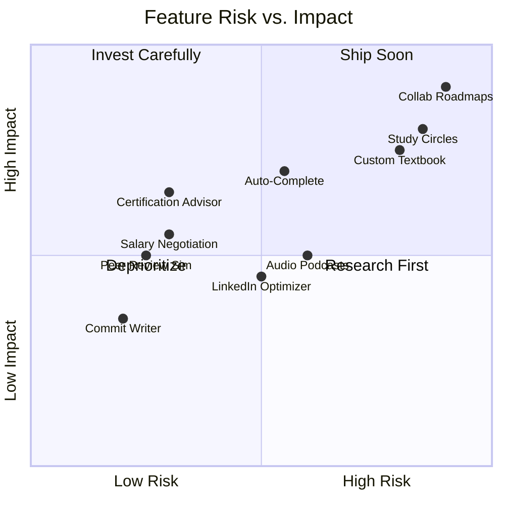

# P3 — Exploratory: Implementation Plan

> **12 features** · Research-stage, long-term innovation · 12–18 months · ~160 engineering hours
> These are frontier features that push RoadmapAI beyond a learning platform into a full career development ecosystem. Several require significant R&D, third-party integrations, or multi-user infrastructure. All P0, P1, and most P2 features are assumed operational.

---

## Feature Inventory

| # | Feature | Category | Est. Hours | Dependencies | R&D Risk |
|---|---|---|---|---|---|
| 18 | AI Mock Peer Review Simulator | Developer Tools | 14 | P1 #15 (Grader) | Low |
| 20 | AI Syntax Auto-Complete & Copilot | Developer Tools | 16 | Monaco editor | Medium |
| 21 | AI Commit Message & Documentation Writer | Developer Tools | 8 | Monaco editor | Low |
| 28 | AI Salary Negotiation Simulator | Career Intel | 10 | P1 #26 (STAR) | Low |
| 30 | AI LinkedIn Optimizer | Career Intel | 10 | P1 #24 (Resume) | Medium |
| 32 | AI Certification Path Advisor | Career Intel | 12 | P0 #3 (Skill Taxonomy) | Low |
| 36 | AI Audio Lesson Podcast Generator | Content | 14 | — | Medium |
| 40 | AI Dynamic Custom Textbook Compiler | Content | 18 | P0 #10 (Summarizer) | High |
| 46 | AI Peer Study Circle Matchmaker | Social | 16 | — | High |
| 50 | AI Collaborative Roadmap Builder | Social | 18 | Firestore real-time | High |

> [!IMPORTANT]
> Features 40, 46, and 50 carry **high R&D risk** due to complex multi-user infrastructure, real-time sync requirements, or computationally expensive content generation. Budget 2x estimated hours for these.

---

## Risk Assessment Matrix



---

## Feature 18: AI Mock Peer Review Simulator

### Problem
Students never experience code review before their first job, leaving them unprepared for PR-based workflows.

### Technical Design

#### Multi-Persona System
```typescript
type ReviewerPersona = 'strict_senior' | 'supportive_mid' | 'inquisitive_junior'

const PERSONAS: Record<ReviewerPersona, string> = {
  strict_senior: `You are a strict senior engineer with 12 years of experience.
    Focus on: performance, scalability, design patterns, edge cases.
    Tone: direct, no-nonsense, occasionally critical. Use phrases like "This won't scale" and "Consider the edge case where..."
    Standards: You reject code that works but isn't production-ready.`,
    
  supportive_mid: `You are a supportive mid-level engineer with 5 years of experience.
    Focus on: readability, naming conventions, documentation, testing.
    Tone: encouraging but honest. Use phrases like "Nice approach! One thing to consider..." and "This is clean, but we could improve..."
    Standards: You approve working code with improvement suggestions.`,
    
  inquisitive_junior: `You are a curious junior engineer with 1 year of experience.
    Focus on: understanding why decisions were made, learning from the code.
    Tone: questioning, eager. Use phrases like "Why did you choose this approach?" and "I've seen this done differently — what's the trade-off?"
    Standards: You ask genuine questions rather than approving/rejecting.`
}
```

#### Architecture
1. **Trigger**: "Request Peer Review" button after code submission in playground.
2. **Persona selection**: User picks 1–3 personas, or "Random" for surprise.
3. **Review generation**: Each persona produces GitHub-style inline comments with:
   - Line-specific annotations
   - Overall summary
   - Approval status: "Approved ✅", "Changes Requested 🔄", "Questions ❓"
4. **UI**: GitHub PR review interface with expandable file diffs, comment threads, and resolve buttons.

#### GitHub-Style Comment Schema
```typescript
interface PRComment {
  persona: ReviewerPersona
  line_range: [number, number]
  severity: 'praise' | 'suggestion' | 'issue' | 'question'
  body: string
  code_suggestion?: string      // "Did you mean: ..." block
}

interface PeerReview {
  persona: ReviewerPersona
  avatar: string                // generated avatar URL
  display_name: string
  status: 'approved' | 'changes_requested' | 'commented'
  summary: string
  comments: PRComment[]
  overall_impression: string
}
```

#### Files to Create/Modify
| Action | Path | Purpose |
|---|---|---|
| NEW | `frontend/components/PeerReview.tsx` | GitHub-style review UI |
| NEW | `frontend/components/PRCommentThread.tsx` | Inline comment thread with resolve |
| NEW | `frontend/lib/review-personas.ts` | Persona definitions + prompt templates |
| NEW | `backend/app/code/peer_review.py` | Multi-persona review generation |
| MODIFY | `frontend/components/LessonWorkspace.tsx` | Add "Request Peer Review" button |

---

## Feature 20: AI Syntax Auto-Complete & Copilot

### Problem
Students type boilerplate code manually, which is slow and doesn't reflect real developer workflows with AI assistance.

### Technical Design

#### Architecture
1. **Context injection**: Send the current lesson title, description, and preceding code to Gemini.
2. **Completion trigger**: After a 500ms typing pause, request inline completion suggestions.
3. **Ghost text**: Show suggestion as grayed-out text after cursor (Monaco ghost text API).
4. **Accept**: Tab to accept, Escape to dismiss.
5. **Lesson-aware**: Completions are constrained to the current lesson's technology stack.

#### Throttling Strategy
```typescript
const COMPLETION_CONFIG = {
  debounce_ms: 500,           // wait 500ms after last keystroke
  min_prefix_length: 3,       // at least 3 chars typed
  max_requests_per_minute: 10, // rate limit
  cache_ttl_ms: 60_000,       // cache completions for 1 min
  max_completion_tokens: 100,  // keep suggestions short
}
```

#### Monaco Integration
```typescript
// Register inline completion provider
monaco.languages.registerInlineCompletionsProvider('javascript', {
  provideInlineCompletions: async (model, position, context) => {
    const prefix = model.getValueInRange({
      startLineNumber: Math.max(1, position.lineNumber - 10),
      startColumn: 1,
      endLineNumber: position.lineNumber,
      endColumn: position.column
    })
    
    const completion = await fetchCompletion(prefix, lessonContext)
    
    return {
      items: [{
        insertText: completion,
        range: new monaco.Range(
          position.lineNumber, position.column,
          position.lineNumber, position.column
        )
      }]
    }
  }
})
```

#### Files to Create/Modify
| Action | Path | Purpose |
|---|---|---|
| NEW | `frontend/lib/copilot.ts` | Completion provider + caching + throttling |
| MODIFY | `frontend/components/LessonWorkspace.tsx` | Register completion provider with Monaco |
| NEW | `backend/app/code/complete.py` | Gemini completion endpoint |
| NEW | `frontend/components/CopilotToggle.tsx` | Enable/disable toggle in editor toolbar |

---

## Feature 21: AI Commit Message & Documentation Writer

### Technical Design

1. **Diff detection**: Compare initial code template vs. current code → generate diff.
2. **Commit message**: Gemini analyzes diff → generates conventional commit message.
3. **Documentation**: Generate JSDoc/docstring comments for functions in the code.
4. **Teaching angle**: Show the generated commit message with an explanation of the format, teaching Git conventions.

#### Files to Create/Modify
| Action | Path | Purpose |
|---|---|---|
| NEW | `frontend/components/CommitWriter.tsx` | Commit message display + format explanation |
| NEW | `frontend/lib/diff-generator.ts` | Code diff computation |
| NEW | `backend/app/code/commit_writer.py` | Gemini commit message + doc generation |
| MODIFY | `frontend/components/LessonWorkspace.tsx` | Add "Generate Commit" and "Add Docs" buttons |

---

## Feature 28: AI Salary Negotiation Simulator

### Technical Design

#### Architecture
1. **Roleplay framework**: Multi-turn conversation where Gemini plays a hiring manager.
2. **Scenario setup**: User inputs: role title, company size, offer amount, desired amount, years of experience.
3. **Negotiation turns**: AI presents offers, counter-offers, and pressure tactics. User responds.
4. **Scoring dimensions**:
   - Value articulation (0–10): Did they explain their worth with evidence?
   - Anchoring strategy (0–10): Did they set a strong initial number?
   - Composure under pressure (0–10): Did they stay firm when pushed?
   - Final outcome vs. target: % of desired amount achieved
5. **Coaching tips**: After session, review each turn with specific improvement suggestions.

#### Conversation State Machine
```
START → AI presents initial offer
  → User responds (accept / counter / ask for more info)
  → AI adjusts (escalates, holds firm, or concedes partially)
  → [Repeat max 5 turns]
  → RESOLUTION: final agreed amount
  → DEBRIEF: turn-by-turn scoring + coaching
```

#### Files to Create/Modify
| Action | Path | Purpose |
|---|---|---|
| NEW | `frontend/components/SalaryNegotiator.tsx` | Chat-based negotiation UI |
| NEW | `frontend/components/NegotiationDebrief.tsx` | Turn-by-turn scoring review |
| NEW | `backend/app/career/negotiation.py` | Gemini negotiation agent |
| MODIFY | `frontend/app/interview/page.tsx` | Add "Salary Negotiation" mode |

---

## Feature 30: AI LinkedIn Optimizer

### Technical Design

1. **Input**: User pastes their LinkedIn summary, headline, and experience sections.
2. **Analysis**: Gemini evaluates keyword density, impact verb usage, quantified achievements, and skills alignment with completed roadmaps.
3. **Output**: Rewritten sections with tracked changes (diff view), keyword optimization score, and A/B headline variants.

#### Files to Create/Modify
| Action | Path | Purpose |
|---|---|---|
| NEW | `frontend/components/LinkedInOptimizer.tsx` | Input + analysis + rewrite UI |
| NEW | `backend/app/career/linkedin_optimizer.py` | Gemini profile analysis + rewrite |
| MODIFY | `frontend/app/career/page.tsx` | Add LinkedIn tab (assumes P2 #25 Career page exists) |

---

## Feature 32: AI Certification Path Advisor

### Technical Design

#### Architecture
1. **Certification database**: Store syllabus outlines for 30+ certifications (AWS, GCP, Azure, Kubernetes, etc.).
2. **Coverage analysis**: Map user's completed lesson content to certification syllabus topics using embeddings.
3. **Gap percentage**: "You're 85% ready for AWS Solutions Architect Associate."
4. **Prep plan generation**: For the remaining 15%, generate a focused study plan with timeline.

#### Certification Schema
```typescript
interface Certification {
  id: string
  name: string                    // "AWS Solutions Architect Associate"
  provider: string                // "Amazon Web Services"
  difficulty: 'beginner' | 'intermediate' | 'advanced'
  syllabus_topics: string[]       // ["VPC Networking", "IAM Policies", ...]
  topic_embeddings: number[][]    // pre-computed embeddings
  exam_format: string             // "65 questions, 130 minutes"
  cost: string                    // "$150 USD"
  validity_years: number
}
```

#### Files to Create/Modify
| Action | Path | Purpose |
|---|---|---|
| NEW | `frontend/components/CertificationAdvisor.tsx` | Coverage % display + prep plan |
| NEW | `frontend/lib/certification-db.ts` | Certification syllabus data |
| NEW | `backend/app/career/certification.py` | Coverage analysis + prep plan generation |
| MODIFY | `frontend/app/career/page.tsx` | Add "Certifications" tab |

---

## Feature 36: AI Audio Lesson Podcast Generator

### Technical Design

#### Architecture
1. **Script generation**: Gemini converts lesson content into a conversational podcast script between two AI hosts ("Teacher" and "Curious Student").
2. **TTS rendering**: Google Cloud TTS (or ElevenLabs for premium voices) renders each speaker's lines with distinct voices.
3. **Audio assembly**: Server-side concatenation of audio segments into a single MP3/OGG file.
4. **Player UI**: In-app audio player with playback speed control, timestamps linked to lesson sections.

#### Pipeline
```
Lesson content → Gemini script generation → Script segments with speaker tags
  → TTS API (voice A for Teacher, voice B for Student)
  → Audio segment files → FFmpeg concatenation → Final MP3
  → Stored in Firebase Storage → Streamed to client
```

#### Cost Consideration
Google Cloud TTS pricing: ~$4 per 1M characters. A 10-minute podcast ≈ 5000 characters = $0.02/podcast.
At 1000 podcasts/month = $20/month.

#### Files to Create/Modify
| Action | Path | Purpose |
|---|---|---|
| NEW | `frontend/components/PodcastPlayer.tsx` | Audio player with timestamps |
| NEW | `backend/app/content/podcast_generator.py` | Script generation + TTS + assembly |
| MODIFY | `frontend/components/LessonWorkspace.tsx` | Add "Listen as Podcast" button |

---

## Feature 40: AI Dynamic Custom Textbook Compiler

### Technical Design

#### Architecture
1. **Content aggregation**: Collect all lesson summaries (P0 Feature 10), user notes, AI explanations, and code samples for a roadmap phase.
2. **Long-form generation**: Gemini compiles into a structured textbook with:
   - Table of contents
   - Chapter introductions
   - Key concept summaries
   - Code examples with annotations
   - Practice exercises
   - Glossary
3. **Rendering**: Puppeteer on the server generates a styled PDF with custom cover page.
4. **Personalization**: Cover includes the user's name, roadmap title, and completion date.

#### Risk Mitigation
- **Token limits**: Generate chapter-by-chapter, not the entire book in one call.
- **Quality control**: Each chapter gets a separate Gemini call with specific formatting instructions.
- **Caching**: Generated textbooks are cached and only regenerated when new content is completed.

#### Files to Create/Modify
| Action | Path | Purpose |
|---|---|---|
| NEW | `frontend/app/textbook/page.tsx` | Textbook preview + download page |
| NEW | `backend/app/content/textbook_compiler.py` | Chapter generation + PDF assembly |
| NEW | `backend/app/content/pdf_renderer.py` | Puppeteer PDF rendering |
| MODIFY | `frontend/app/roadmap/[id]/page.tsx` | Add "Generate Textbook" button |

---

## Feature 46: AI Peer Study Circle Matchmaker

### Technical Design

#### Architecture
1. **User embedding**: Compute a "learner profile" embedding from: current roadmap topics, skill level, timezone, study pace.
2. **Matching algorithm**: K-nearest neighbors on learner embeddings → form groups of 3–5 with similar profiles.
3. **Chat room**: Firebase Realtime Database for group chat with AI moderator.
4. **AI moderator**: Gemini-powered bot that:
   - Posts a daily discussion topic
   - Answers questions when the group is stuck
   - Summarizes weekly group progress
5. **Weekly challenges**: Group-specific coding challenges graded on collective performance.

#### Matching Schema
```typescript
interface LearnerProfile {
  userId: string
  roadmapTopics: string[]
  skillLevel: number           // from IRT model
  timezone: string
  weeklyVelocity: number
  embedding: number[]          // computed from above features
}

interface StudyCircle {
  id: string
  members: string[]            // userIds
  roadmapFocus: string
  created_at: string
  chat_channel_id: string
  ai_moderator_enabled: boolean
}
```

#### Files to Create/Modify
| Action | Path | Purpose |
|---|---|---|
| NEW | `frontend/app/circles/page.tsx` | Study circle discovery + management |
| NEW | `frontend/components/CircleChat.tsx` | Real-time group chat UI |
| NEW | `frontend/components/CircleMatcher.tsx` | Match suggestion cards |
| NEW | `backend/app/social/matchmaker.py` | Embedding computation + KNN matching |
| NEW | `backend/app/social/moderator.py` | AI moderator agent |

---

## Feature 50: AI Collaborative Roadmap Builder

### Technical Design

#### Architecture
1. **Base roadmap**: Instructor/mentor creates a roadmap using the existing generator.
2. **Fork system**: Students fork the roadmap → personal copy with custom pacing.
3. **Real-time sync**: Firestore onSnapshot listeners for live collaboration.
4. **Conflict resolution**: When mentor updates the base roadmap:
   - Detect conflicts with student forks
   - Gemini suggests merge strategies
   - Students accept/reject changes
5. **Annotation layer**: Mentors can add inline notes, additional resources, and custom exercises to specific lessons.

#### Operational Transform (Simplified)
```typescript
interface RoadmapOperation {
  type: 'add_lesson' | 'remove_lesson' | 'modify_lesson' | 'reorder' | 'add_note'
  path: string                // e.g., "phases[0].chapters[1].lessons[2]"
  author: string
  timestamp: string
  data: any
}

// Conflict detection:
// If two ops target the same path within 5 seconds, flag as conflict
// Gemini arbitrates: "Mentor added a note to Lesson 3, Student removed Lesson 3. 
//                     Suggested resolution: Keep lesson, add mentor note as supplementary."
```

#### Files to Create/Modify
| Action | Path | Purpose |
|---|---|---|
| NEW | `frontend/app/collab/[id]/page.tsx` | Collaborative editor page |
| NEW | `frontend/components/CollabEditor.tsx` | Real-time roadmap editor with presence |
| NEW | `frontend/components/MergeResolver.tsx` | Conflict resolution UI |
| NEW | `frontend/lib/collab-sync.ts` | Firestore real-time sync + OT |
| NEW | `backend/app/collab/merge.py` | Gemini merge suggestion engine |

---

## Sprint Plan

### Sprint 17 (Month 10, Weeks 1–2)
- [ ] Feature 21: Commit Writer — diff analysis + conventional commit generation
- [ ] Feature 28: Salary Negotiation Simulator — roleplay engine + scoring
- [ ] Feature 18: Peer Review Simulator — multi-persona prompts + PR UI

### Sprint 18 (Month 10, Weeks 3–4)
- [ ] Feature 30: LinkedIn Optimizer — profile analysis + rewrite suggestions
- [ ] Feature 32: Certification Advisor — syllabus database + coverage analysis
- [ ] Feature 20: Auto-Complete & Copilot — Monaco inline completions (prototype)

### Sprint 19 (Month 11, Weeks 1–2)
- [ ] Feature 36: Audio Podcast Generator — TTS pipeline + player UI
- [ ] Feature 40: Custom Textbook Compiler — chapter generation + PDF rendering (Part 1)

### Sprint 20 (Month 11, Weeks 3–4)
- [ ] Feature 40: Custom Textbook Compiler (Part 2) — cover design + caching + finalization
- [ ] Feature 20: Auto-Complete & Copilot — lesson-aware context + throttling (finalize)

### Sprint 21 (Month 12, Weeks 1–2)
- [ ] Feature 46: Study Circle Matchmaker — embedding pipeline + matching algorithm + chat UI
- [ ] Feature 50: Collaborative Roadmap Builder — fork system + real-time sync (Part 1)

### Sprint 22 (Month 12, Weeks 3 – Month 13)
- [ ] Feature 50: Collaborative Roadmap Builder (Part 2) — conflict resolution + merge suggestions
- [ ] Feature 46: Study Circle Matchmaker — AI moderator + weekly challenges
- [ ] Integration testing, stress testing multi-user features, UX polish

### Sprint 23 (Month 13–14)
- [ ] Beta testing all P3 features with 50–100 users
- [ ] Performance optimization for real-time features
- [ ] Cost analysis and optimization for TTS/PDF generation

---

## Infrastructure Additions

| Component | Technology | Purpose | Est. Cost/Month |
|---|---|---|---|
| Google Cloud TTS | Text-to-speech | Podcast generation (#36) | $20–80 |
| Puppeteer (server) | Headless Chrome | Textbook PDF rendering (#40) | $0 + compute |
| Firebase Realtime DB | Real-time sync | Chat (#46), Collab (#50) | $0–50 |
| ElevenLabs (optional) | Premium TTS voices | Higher quality podcasts | $5–22 |
| Cloud Run / Functions | Serverless compute | Heavy generation tasks | $20–100 |
| Firebase Storage | File hosting | Generated PDFs, audio files | $0–25 |

**Total estimated P3 infrastructure**: $45–277/month at scale.

---

## Research Spikes Required

Before full implementation, the following require dedicated research time:

| Spike | Duration | Question to Answer |
|---|---|---|
| Copilot latency | 2 days | Can we achieve <300ms completion time with Gemini? |
| TTS voice quality | 1 day | Is Google Cloud TTS conversational enough, or do we need ElevenLabs? |
| Textbook token limits | 2 days | What's the optimal chapter-by-chapter generation strategy for Gemini's context window? |
| Real-time sync perf | 3 days | Can Firestore handle 20 concurrent editors on a single roadmap document? |
| Matching algorithm accuracy | 2 days | Does embedding similarity produce meaningful study group matches? |
| PDF rendering cost | 1 day | Puppeteer on Cloud Run — cost per textbook at 1000 users? |

---

## Success Metrics

| Feature | KPI | Target |
|---|---|---|
| Peer Review Simulator | Review request rate | > 25% of challenge completions |
| Auto-Complete | Completion acceptance rate | > 40% |
| Commit Writer | Usage rate per session | > 15% |
| Salary Negotiation | Session completion rate | > 60% |
| LinkedIn Optimizer | Profile update rate after suggestions | > 35% |
| Certification Advisor | Prep plan generation rate | > 20% of eligible users |
| Audio Podcasts | Listen completion rate | > 50% |
| Custom Textbook | Download rate | > 30% of completed roadmaps |
| Study Circles | Weekly active circle participation | > 25% of matched users |
| Collaborative Roadmaps | Fork rate from shared roadmaps | > 15% |

---

## Long-Term Vision

With P3 complete, RoadmapAI transforms from a **learning tool** into a **career development platform**:

```
Solo Learner → Guided Study (P0)
  → Intelligent Practice (P1)
    → Deep Understanding (P2)
      → Career Launch + Community (P3)
```

The feature set at P3 completion covers the entire learner lifecycle:
1. **Discovery**: Goal refinement, prerequisite detection
2. **Learning**: Adaptive content, spaced repetition, flashcards
3. **Practice**: Code playground, debugging, grading, peer review
4. **Career Prep**: Interviews, resume optimization, certification guidance
5. **Community**: Study circles, collaborative roadmaps, shared learning
6. **Retention**: Podcasts, textbooks, knowledge maps, gamification
