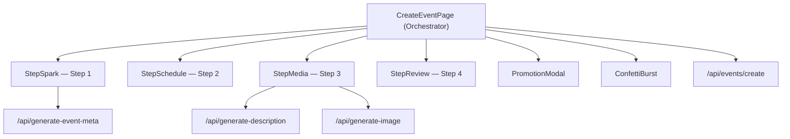
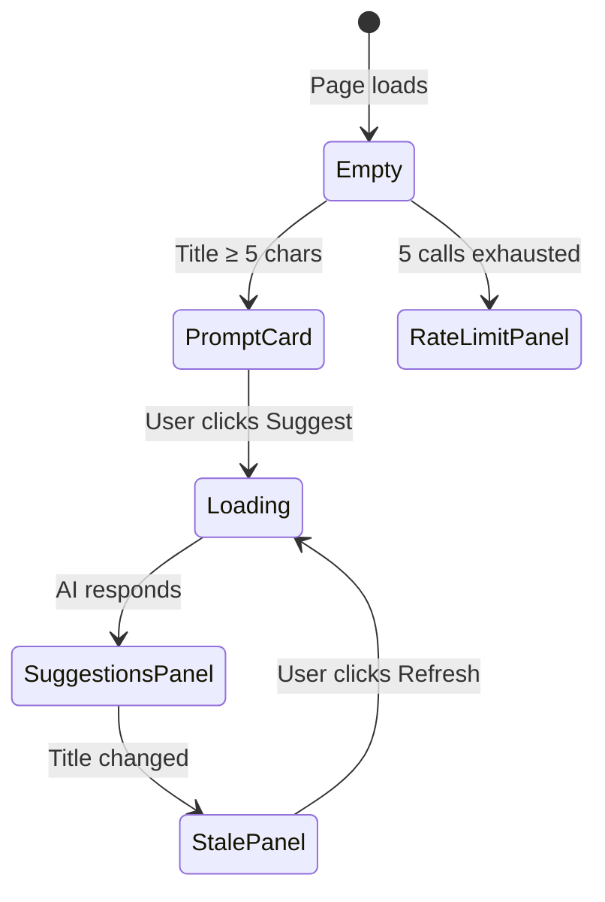
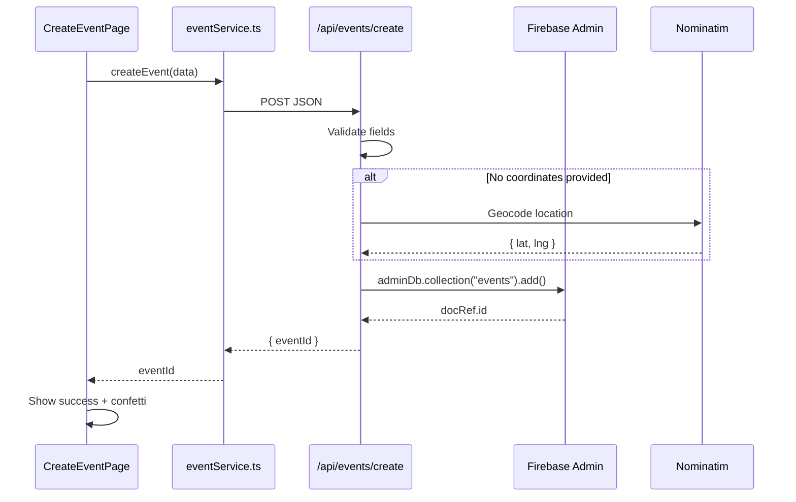

# Event Creation UI — Complete Technical Breakdown

This document dissects every layer of the **event creation wizard** in the IEMxRCC project so you can lift the patterns, architecture, and design decisions into a different context.

---

## 1. High-Level Architecture



The wizard lives at [page.tsx](file:///c:/Users/blazi/Downloads/IEMxRCC-1/frontend/src/app/(app)/create/page.tsx) and is a **single-page, client-side multi-step form** (not route-per-step). Each step is a separate component under [_components/](file:///c:/Users/blazi/Downloads/IEMxRCC-1/frontend/src/app/(app)/create/_components).

### Key Design Decisions
| Decision | Rationale |
|---|---|
| **All state lifted to parent** | A single source of truth; any step can read/write any field; the Review step has access to everything |
| **`AnimatePresence` + `motion.div` for transitions** | Horizontal slide animations (left/right based on direction) give a polished, directional feel between steps |
| **No route-per-step** | Avoids URL state management and data serialization; keeps the flow instant with zero page loads |
| **Step validation is step-scoped** | `canProceed(step)` only checks what's needed for that step, not the entire form |

---

## 2. The Wizard Orchestrator

> File: [page.tsx](file:///c:/Users/blazi/Downloads/IEMxRCC-1/frontend/src/app/(app)/create/page.tsx)

### 2.1 Step Configuration

```typescript
const STEPS = [
  { icon: ZapIcon,        label: 'The Spark',    subtitle: 'Basic info' },
  { icon: MapPin,         label: 'When & Where', subtitle: 'Time & location' },
  { icon: FileImage,      label: 'Content',      subtitle: 'Details & media' },
  { icon: ClipboardCheck, label: 'Review',       subtitle: 'Publish' },
];
```

Each step has an **icon**, **label**, and **subtitle**. The step definitions drive both the navigation UI and the header content. To adapt this, simply change the STEPS array to your domain — the rest of the wizard adjusts automatically.

### 2.2 State Management (All State in Parent)

The parent component owns **all** form fields as individual `useState` hooks:

```typescript
// Core event fields
const [title, setTitle]             = useState('');
const [description, setDescription] = useState('');
const [category, setCategory]       = useState('🎓 Academic');
const [image, setImage]             = useState('');
const [eventDate, setEventDate]     = useState('');
const [urgency, setUrgency]         = useState<'high' | 'normal'>('normal');
const [locationName, setLocationName] = useState('');
const [lat, setLat]                 = useState<number | undefined>();
const [lng, setLng]                 = useState<number | undefined>();

// Resource needs (optional toggles)
const [needFunds, setNeedFunds]     = useState(false);
const [fundGoal, setFundGoal]       = useState(1000);
const [needVols, setNeedVols]       = useState(false);
const [volGoal, setVolGoal]         = useState(10);
const [needGoods, setNeedGoods]     = useState(false);
const [goodsItem, setGoodsItem]     = useState('');
const [goodsList, setGoodsList]     = useState<string[]>([]);

// UI state
const [step, setStep]               = useState(1);
const [direction, setDirection]     = useState(1);  // 1 = forward, -1 = back
const [loading, setLoading]         = useState(false);
const [publishSuccess, setPublishSuccess] = useState(false);
const [showConfetti, setShowConfetti]     = useState(false);
const [draftDescription, setDraftDescription] = useState('');
```

> [!TIP]
> **For your adaptation**: If you have more than ~12 fields, consider replacing individual `useState` calls with a single `useReducer` or a form library like `react-hook-form`. The current approach works well for this field count and avoids over-engineering.

### 2.3 Navigation Logic

```typescript
const canProceed = (s: number) => {
  if (s === 1) return title.trim().length >= 5;
  if (s === 2) return !!eventDate;
  return true;
};

const goToStep = (target: number) => {
  setDirection(target > step ? 1 : -1);  // determines animation direction
  setStep(target);
};

const handleNext = () => {
  if (!canProceed(step)) {
    if (step === 1) toast.error('Event title must be at least 5 characters.');
    if (step === 2) toast.error('Please pick a date & time.');
    return;
  }
  // Auto-apply AI draft description if user hasn't typed their own
  if (step === 1 && draftDescription && !description) setDescription(draftDescription);
  setDirection(1);
  setStep(s => Math.min(s + 1, TOTAL_STEPS));
};

const handleBack = () => {
  setDirection(-1);
  setStep(s => Math.max(s - 1, 1));
};
```

**Key pattern**: The `direction` state (`1` or `-1`) is passed as a `custom` prop to framer-motion's `AnimatePresence`. This makes the slide animation go **left** when advancing and **right** when going back.

### 2.4 Animation Variants

```typescript
const variants = {
  enter: (dir: number) => ({ x: dir > 0 ? 40 : -40, opacity: 0 }),
  center: { x: 0, opacity: 1 },
  exit:  (dir: number) => ({ x: dir > 0 ? -40 : 40, opacity: 0 }),
};
```

Used by `AnimatePresence mode="wait"` to animate the step body:

```tsx
<AnimatePresence mode="wait" custom={direction}>
  <motion.div
    key={step}           // forces re-mount on step change
    custom={direction}
    variants={variants}
    initial="enter"
    animate="center"
    exit="exit"
    transition={{ duration: 0.28, ease: [0.16, 1, 0.3, 1] }}
  >
    {/* Step content */}
  </motion.div>
</AnimatePresence>
```

> [!IMPORTANT]
> The `key={step}` is critical. Without it, React won't re-mount the component and the enter/exit animations won't fire.

---

## 3. Desktop Navigation — Step Progress Bar

The desktop step bar is a row of **clickable step indicators** connected by **progress lines**:

```
[✓ The Spark] ─── [✓ When & Where] ─── [● Content] ─── [○ Review]
```

### Visual Rules
| State | Icon | Background | Border | Clickable? |
|---|---|---|---|---|
| **Completed** | `<Check>` checkmark | `var(--cp-primary)` (solid fill) | `var(--cp-primary)` | ✅ Yes — jumps back |
| **Active** | Step's own icon | `var(--cp-primary)` (solid fill) | `var(--cp-primary)` | ❌ No |
| **Future** | Step's own icon | `var(--cp-surface-dim)` (muted) | `var(--cp-border)` | ❌ No |

**Connector lines** between steps change from `var(--cp-border)` (faded) to `var(--cp-primary)` (filled) as steps are completed.

### Mobile Navigation

On mobile (`md:hidden`), the desktop step bar is replaced by:
1. **Top bar**: "Step X of Y" label + step label + back button
2. **Segmented progress track**: 4 thin horizontal bars that fill with `var(--cp-primary)` as progress advances

---

## 4. Step 1: "The Spark" (StepSpark)

> File: [StepSpark.tsx](file:///c:/Users/blazi/Downloads/IEMxRCC-1/frontend/src/app/(app)/create/_components/StepSpark.tsx)

This is the most complex step. It collects **title**, **category**, and **urgency**, with an integrated **AI suggestion panel**.

### 4.1 Title Input

```tsx
<input
  type="text"
  value={title}
  onChange={e => { setTitle(e.target.value); setTitleTouched(true); }}
  placeholder="e.g. Midnight Hackathon, Campus Cleanup Drive..."
  className="input-base w-full text-2xl md:text-3xl font-headline font-bold py-4 px-0"
  style={{
    background: 'transparent',
    border: 'none',
    borderBottom: titleError ? '2px solid var(--cp-accent)' : /* ... */,
    borderRadius: 0,
  }}
  autoFocus
/>
```

- **Minimal styling**: transparent background, bottom border only — feels like a heading you're typing
- **Validation**: title must be ≥ 5 characters. Error state shows a red accent border and helper text
- **Status row below**: dynamically shows contextual messages: "Keep going...", "Ready — click Suggest for AI recommendations", "Title changed — refresh suggestions", etc.

### 4.2 AI Suggestion System

This is the standout feature. When the title is ≥ 5 chars, a **"Suggest"** button appears. Clicking it:

1. Calls [/api/generate-event-meta](file:///c:/Users/blazi/Downloads/IEMxRCC-1/frontend/src/app/api/generate-event-meta/route.ts) with the title
2. Gemini AI returns: `suggestedCategory`, `suggestedUrgency`, `suggestedTags[]`, `draftDescription`
3. Results appear in a styled panel with **one-click "Apply"** buttons

#### Rate Limiting & Caching

```typescript
const suggestionCache = new Map<string, AiSuggestion>();  // in-memory
let sessionCallCount = 0;
const SESSION_LIMIT = 5;
```

- **Client-side cache**: Results are keyed by `title.toLowerCase()`. Revisiting a previously-typed title uses the cache instantly
- **Session rate limit**: Max 5 AI calls per page session. Shows a warning panel when exhausted
- **Stale detection**: If the user changes the title after fetching, suggestions are marked "Stale — title changed" with a gold border, and the button changes to "Refresh"

#### AI Panel States



#### Apply Buttons

Each suggestion (category, urgency) has its own **Apply** button that:
- Sets the corresponding state in the parent
- Toggles to a green "Applied: [value]" state with a checkmark
- Becomes disabled after applying

Tags are displayed as non-interactive pills.

### 4.3 Category Picker

A **2×4 grid** (mobile) / **4-column grid** (desktop) of icon+label buttons:

```typescript
const CATEGORIES = [
  { value: '🎓 Academic',       label: 'Academic',       Icon: GraduationCap },
  { value: '🎉 Social',         label: 'Social',         Icon: Users         },
  { value: '🏆 Sports & Fitness', label: 'Sports',       Icon: Trophy        },
  { value: '💻 Tech',           label: 'Tech',           Icon: Code2         },
  // ... 8 total
];
```

Selected item gets `var(--cp-primary)` background + white text. Unselected items have `var(--cp-surface-dim)` + subtle border, with `hover:scale-[1.02]` and `active:scale-95` micro-interactions.

### 4.4 Urgency Picker

Two large buttons in a **1×2 grid** (mobile) / **2-column grid** (desktop):
- **Normal**: Green secondary color when selected
- **High Priority**: Red accent color + Zap icon when selected

---

## 5. Step 2: "When & Where" (StepSchedule)

> File: [StepSchedule.tsx](file:///c:/Users/blazi/Downloads/IEMxRCC-1/frontend/src/app/(app)/create/_components/StepSchedule.tsx)

Two sections: **Date & Time** and **Location**.

### 5.1 Quick Pick Buttons

```typescript
const quickPicks = [
  { label: 'Today 6 PM',     getValue: () => { /* ... */ } },
  { label: 'Tomorrow 10 AM', getValue: () => { /* ... */ } },
  { label: 'This Weekend',   getValue: () => { /* ... */ } },
];
```

Three preset buttons that compute relative dates dynamically. Clicking one pre-fills the date picker. This is a **great UX shortcut** — eliminates the most common manual date picking.

### 5.2 Date Picker

Wraps a custom `<DateTimePicker>` component inside a bordered container. Selected date is displayed as a human-readable string below (e.g., "Friday, June 20, 2025, 06:00 PM").

### 5.3 Location Picker

Uses `<LocationPickerWrapper>` which integrates a **map-based location selector**. Returns `{ name, lat, lng }`. The callback is clean:

```tsx
<LocationPickerWrapper
  onLocationSelect={loc => {
    setLocationName(loc.name);
    setLat(loc.lat);
    setLng(loc.lng);
  }}
/>
```

> [!TIP]
> **For your adaptation**: If you don't need map integration, replace this with a simple text input + optional geocoding call. The API already supports server-side geocoding via Nominatim as a fallback.

---

## 6. Step 3: "Content" (StepMedia)

> File: [StepMedia.tsx](file:///c:/Users/blazi/Downloads/IEMxRCC-1/frontend/src/app/(app)/create/_components/StepMedia.tsx)

Three sections: **Description**, **Cover Image**, and **Resource Needs**.

### 6.1 Description with AI Generation

- **Textarea** with character count overlay
- **"Generate with AI" button** calls [/api/generate-description](file:///c:/Users/blazi/Downloads/IEMxRCC-1/frontend/src/app/api/generate-description/route.ts) → sends `{ title, category }` → returns a 2-3 sentence description
- Note: "AI-drafted — feel free to edit" hint appears when AI content is present

### 6.2 Cover Image — Dual Input

Two parallel input methods:

| Method | How it works |
|---|---|
| **Upload** | Standard file input styled as a dashed-border upload zone. Uses `uploadImage()` from `storageService` to push to Firebase Storage |
| **AI Generate** | Calls `/api/generate-image` with a prompt built from title + category. The returned blob is uploaded to Firebase Storage and the URL is stored |

Image preview shows as a small 80×80 thumbnail next to the upload zone, with an X button overlay on hover to remove.

### 6.3 Resource Needs (Collapsible)

An **expandable section** using framer-motion's `height: auto` animation:

```tsx
<motion.div
  initial={{ height: 0, opacity: 0 }}
  animate={{ height: 'auto', opacity: 1 }}
  exit={{ height: 0, opacity: 0 }}
/>
```

Three toggle-able resource types:

| Resource | Toggle | When Enabled |
|---|---|---|
| **Funding** | Checkbox | Shows a number input for dollar goal |
| **Attendees** | Checkbox | Shows a number input for volunteer count |
| **Goods/Items** | Checkbox | Shows a text input + "Add" button that builds a dynamic list. Items can be removed individually with X buttons |

The goods list uses an **enter-to-add** pattern with `onKeyDown` handling.

---

## 7. Step 4: "Review" (StepReview)

> File: [StepReview.tsx](file:///c:/Users/blazi/Downloads/IEMxRCC-1/frontend/src/app/(app)/create/_components/StepReview.tsx)

A **read-only summary** of everything the user entered, with **edit shortcuts**.

### 7.1 Cover Image Hero

If an image is set, it renders as a **full-width hero** (220px height) with:
- The image as background
- A gradient overlay (`from-black/60 to-transparent`)
- Title + category overlay text in white at the bottom

If no image, a simple placeholder says "No image — a default will be used".

### 7.2 Details Table

Uses a **label-value row** pattern with consistent styling:

```typescript
const rowStyle = {
  display: 'flex',
  borderBottom: '1px solid var(--cp-border)',
  padding: '1rem 0',
  gap: '1rem',
  alignItems: 'flex-start',
};

const labelStyle = {
  width: '140px',
  fontSize: '11px',
  fontWeight: 700,
  textTransform: 'uppercase',
  letterSpacing: '0.07em',
  color: 'var(--cp-text-3)',
};
```

Rows: Category, Urgency (color-coded), Date & Time (with Calendar icon), Location (with MapPin icon), Description (truncated to 220 chars), Needs (as colored badge pills).

### 7.3 Edit Shortcuts

A **4-column grid** of "Edit [Section]" buttons that call `goToStep(n)` to jump back to any previous step:

```tsx
{['Title & Category', 'Date & Location', 'Content', 'Back to top'].map((label, idx) => (
  <button onClick={() => goToStep(idx + 1)}>
    ← Edit {label.split(' ')[0]}
  </button>
))}
```

---

## 8. Bottom Action Bar

The parent component renders a **sticky bottom bar** with:

| Step | Left Button | Right Button(s) |
|---|---|---|
| 1 | Back (disabled) | Continue → |
| 2-3 | ← Back | Continue → |
| 4 | ← Back | **Promote** (secondary) + **Publish Event** (primary) |

The "Publish" button shows a spinner + "Publishing..." when loading.

---

## 9. Success State & Celebration

After successful creation:

```tsx
if (publishSuccess) {
  return (
    <main>
      <ConfettiBurst trigger={showConfetti} onComplete={() => setShowConfetti(false)} />
      <motion.div initial={{ opacity: 0, y: 24 }} animate={{ opacity: 1, y: 0 }}>
        <PartyPopper icon />
        <h1>Event Published</h1>
        <p>"{title}" is now live on the campus feed.</p>
        <button>View Event</button>
        <button onClick={resetWizard}>Create Another</button>
      </motion.div>
    </main>
  );
}
```

- **Confetti animation** fires on publish
- **"Create Another"** button calls `resetWizard()` which clears all state and returns to Step 1
- **"View Event"** navigates to `/event/{id}`

---

## 10. Backend API Layer

### Event Metadata Generation

> [/api/generate-event-meta](file:///c:/Users/blazi/Downloads/IEMxRCC-1/frontend/src/app/api/generate-event-meta/route.ts)

- Uses **Google Generative AI** (Gemini) with model fallback chain: `gemini-2.5-flash` → `gemini-2.0-flash-lite` → `gemini-flash-latest`
- Sends a structured prompt requesting JSON output
- Strips markdown code fences from response before parsing
- Returns: `{ suggestedCategory, suggestedUrgency, suggestedTags[], draftDescription }`

### Event Creation

> [/api/events/create](file:///c:/Users/blazi/Downloads/IEMxRCC-1/frontend/src/app/api/events/create/route.ts)

- Uses **Firebase Admin SDK** (server-side)
- Auto-geocodes location via **Nominatim** if no lat/lng provided
- Initializes `status: 'active'`, `progress: 0`, and zeroed-out needs counters
- Returns `{ eventId }` on success

### Data Flow



---

## 11. Design System Tokens Used

The entire UI uses **CSS custom properties** (no hardcoded colors anywhere):

| Token | Purpose |
|---|---|
| `--cp-primary` | Primary brand color (buttons, active states, links) |
| `--cp-secondary` | Success / confirmation color |
| `--cp-accent` | Warning / high-urgency color (red) |
| `--cp-background` | Page background |
| `--cp-surface` | Card/container background |
| `--cp-surface-dim` | Muted surface (inputs, inactive buttons) |
| `--cp-border` | Borders, dividers |
| `--cp-text-1` | Primary text |
| `--cp-text-2` | Secondary text |
| `--cp-text-3` | Tertiary/muted text |
| `--cp-gold` | Rate limit warnings, cached indicators |
| `--cp-cyan` | Image generation accent |

> [!IMPORTANT]
> The `hsl(from var(--cp-primary) h s l / 0.08)` syntax (relative color) is used extensively for semi-transparent tinted backgrounds. This requires modern browser support.

---

## 12. Reusability Guide — Adapting This for Your Context

### Pattern: Multi-Step Wizard
**What to keep**: The orchestrator pattern (parent holds state, steps are presentational), AnimatePresence directional transitions, step configuration array, validation-per-step.

**What to change**: Step content, field names, STEPS array labels/icons.

### Pattern: AI-Assisted Form Fields
**What to keep**: The suggest → preview → apply pattern, client-side caching with `Map`, session rate limiting, stale detection when input changes.

**What to change**: API endpoint, prompt, returned fields, the Apply button targets.

### Pattern: Toggle-Revealed Sub-forms
**What to keep**: The checkbox → reveal pattern (Resource Needs section), the animated height expansion, the dynamic list with add/remove.

**What to change**: The specific resource types and their associated inputs.

### Pattern: Review + Edit Shortcuts
**What to keep**: The summary view with `goToStep()` jump buttons, the label-value row layout, the hero image with gradient overlay.

**What to change**: The fields being summarized.

### Pattern: Success Celebration
**What to keep**: Confetti animation, fade-in success message, "Create Another" reset, "View Created Item" navigation.

**What to change**: Destination route, success copy.

---

## 13. File Map

| File | Role |
|---|---|
| [page.tsx](file:///c:/Users/blazi/Downloads/IEMxRCC-1/frontend/src/app/(app)/create/page.tsx) | Wizard orchestrator (438 lines) |
| [StepSpark.tsx](file:///c:/Users/blazi/Downloads/IEMxRCC-1/frontend/src/app/(app)/create/_components/StepSpark.tsx) | Step 1: Title, Category, Urgency, AI suggestions (353 lines) |
| [StepSchedule.tsx](file:///c:/Users/blazi/Downloads/IEMxRCC-1/frontend/src/app/(app)/create/_components/StepSchedule.tsx) | Step 2: Date/time + Location (102 lines) |
| [StepMedia.tsx](file:///c:/Users/blazi/Downloads/IEMxRCC-1/frontend/src/app/(app)/create/_components/StepMedia.tsx) | Step 3: Description, Image, Resource Needs (307 lines) |
| [StepReview.tsx](file:///c:/Users/blazi/Downloads/IEMxRCC-1/frontend/src/app/(app)/create/_components/StepReview.tsx) | Step 4: Summary + edit shortcuts (185 lines) |
| [WizardProgress.tsx](file:///c:/Users/blazi/Downloads/IEMxRCC-1/frontend/src/app/(app)/create/_components/WizardProgress.tsx) | Alternative pill-tab progress bar (unused in current page, but available) |
| [eventService.ts](file:///c:/Users/blazi/Downloads/IEMxRCC-1/frontend/src/services/eventService.ts) | Client-side service layer |
| [/api/events/create/route.ts](file:///c:/Users/blazi/Downloads/IEMxRCC-1/frontend/src/app/api/events/create/route.ts) | Server-side creation endpoint |
| [/api/generate-event-meta/route.ts](file:///c:/Users/blazi/Downloads/IEMxRCC-1/frontend/src/app/api/generate-event-meta/route.ts) | AI metadata generation endpoint |
| [types/index.ts](file:///c:/Users/blazi/Downloads/IEMxRCC-1/frontend/src/types/index.ts) | TypeScript interfaces (`CommunityEvent`, `EventNeeds`, etc.) |

---

## 14. Dependencies

| Package | Used For |
|---|---|
| `framer-motion` | Step transitions, panel animations, micro-interactions |
| `lucide-react` | All icons (Zap, MapPin, Sparkles, etc.) |
| `sonner` | Toast notifications (error/success) |
| `next/navigation` | Router for post-publish navigation |
| `@google/generative-ai` | Server-side Gemini AI calls |
| `firebase/firestore` | Data persistence |
| `firebase-admin` | Server-side Firestore writes |
