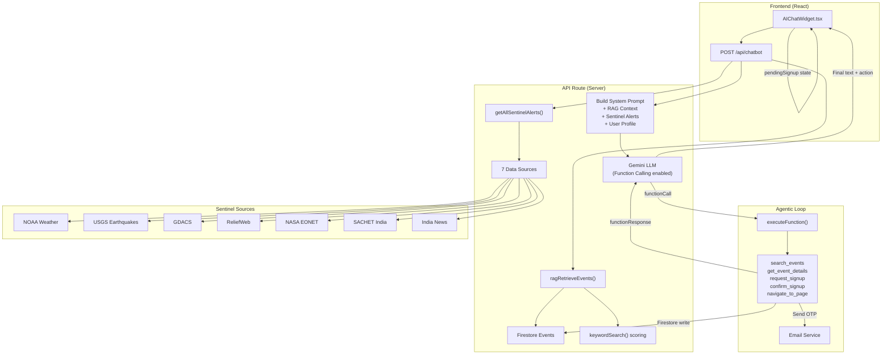

# NexusAid AI Chatbot — Complete Deep Dive

## Table of Contents
1. [Architecture Overview](#1-architecture-overview)
2. [Agentic AI — Function Calling / Tool Use](#2-agentic-ai--function-calling--tool-use)
3. [RAG (Retrieval-Augmented Generation)](#3-rag-retrieval-augmented-generation)
4. [Semantic Search](#4-semantic-search)
5. [Keyword Search (Fallback)](#5-keyword-search-fallback)
6. [Sentinel — Real-Time Disaster Alert Integration](#6-sentinel--real-time-disaster-alert-integration)
7. [Recommendation Engine](#7-recommendation-engine)
8. [Multi-Step Volunteer Signup Flow](#8-multi-step-volunteer-signup-flow)
9. [UI Components](#9-ui-components)
10. [API Routes & Data Flow](#10-api-routes--data-flow)
11. [Error Handling & Resilience](#11-error-handling--resilience)
12. [Complete Data Flow Diagram](#12-complete-data-flow-diagram)

---

## 1. Architecture Overview

The NexusAid chatbot is a **server-side Agentic RAG chatbot** built on top of Google's Gemini LLM. It is not a simple Q&A bot — it can **think, decide which tools to use, execute real actions (Firestore writes, email sends, navigation), and respond** — all within a single conversational turn.

### High-Level Stack

| Layer | Technology | File(s) |
|---|---|---|
| **LLM** | Google Gemini (`gemini-2.5-flash-lite` → `gemini-2.5-flash` → `gemini-2.0-flash-lite`) | [route.ts](file:///c:/Users/blazi/Downloads/NexusAid-Web3/frontend/src/app/api/chatbot/route.ts) |
| **Agentic Tool Use** | Gemini Function Calling with 5 declared tools | [aiActions.ts](file:///c:/Users/blazi/Downloads/NexusAid-Web3/frontend/src/services/aiActions.ts) |
| **RAG Pipeline** | Firestore → Keyword Ranking → Context Injection | [searchService.ts](file:///c:/Users/blazi/Downloads/NexusAid-Web3/frontend/src/services/searchService.ts) |
| **Semantic Search** | Gemini-powered meaning-based event ranking | [searchService.ts](file:///c:/Users/blazi/Downloads/NexusAid-Web3/frontend/src/services/searchService.ts#L101-L166) |
| **Sentinel Alerts** | 7 real-time disaster data sources | [sentinelService.ts](file:///c:/Users/blazi/Downloads/NexusAid-Web3/frontend/src/services/sentinelService.ts) |
| **Recommendation** | Skill-to-category scoring algorithm | [recommendationService.ts](file:///c:/Users/blazi/Downloads/NexusAid-Web3/frontend/src/services/recommendationService.ts) |
| **Email / OTP** | Nodemailer + OTP verification pipeline | [emailService.ts](file:///c:/Users/blazi/Downloads/NexusAid-Web3/frontend/src/services/emailService.ts) |
| **Frontend UI** | React / Next.js floating chat widget with Framer Motion | [AIChatWidget.tsx](file:///c:/Users/blazi/Downloads/NexusAid-Web3/frontend/src/components/AIChatWidget.tsx) |
| **Database** | Firebase Firestore (client + Admin SDK) | [firebase.ts](file:///c:/Users/blazi/Downloads/NexusAid-Web3/frontend/src/lib/firebase.ts), [firebase-admin.ts](file:///c:/Users/blazi/Downloads/NexusAid-Web3/frontend/src/lib/firebase-admin.ts) |

---

## 2. Agentic AI — Function Calling / Tool Use

> **What makes this chatbot "agentic"?**  
> The LLM doesn't just generate text — it **decides which actions to take**, calls server-side functions, receives the results, and incorporates those results into its final response. This is a ReAct-style (Reasoning + Acting) agent loop.

### 2.1 Declared Tools (Function Declarations)

The chatbot has **5 tools** declared in [aiActions.ts](file:///c:/Users/blazi/Downloads/NexusAid-Web3/frontend/src/services/aiActions.ts#L37-L122) and passed to Gemini via the `tools` parameter:

| Tool Name | Purpose | Parameters |
|---|---|---|
| `search_events` | Search events by keyword, category, or description | `query: string` |
| `get_event_details` | Get full details for a specific event by title | `eventTitle: string` |
| `request_signup` | Start volunteer signup — sends OTP email | `eventTitle: string` |
| `confirm_signup` | Complete signup after user provides OTP code | `eventTitle, otpCode, eventId?` |
| `navigate_to_page` | Navigate user to a platform page | `pageName: enum[home, feed, create, dashboard, profile, about]` |

### 2.2 The Agentic Loop

Defined in the [chatbot API route](file:///c:/Users/blazi/Downloads/NexusAid-Web3/frontend/src/app/api/chatbot/route.ts#L177-L231):

```
User Message
    │
    ▼
┌─────────────────────────────────────────────┐
│  Gemini processes message + system prompt   │
│  (includes RAG context + Sentinel alerts)   │
└─────────────────────────┬───────────────────┘
                          │
              ┌───────────▼────────────┐
              │ Response has function  │──── No ──► Extract text → Return
              │ call?                  │
              └───────────┬────────────┘
                          │ Yes
                          ▼
              ┌────────────────────────┐
              │ executeFunction()      │
              │ - Hits Firestore       │
              │ - Sends OTP email      │
              │ - Registers volunteer  │
              └───────────┬────────────┘
                          │
                          ▼
              ┌────────────────────────┐
              │ Send function result   │
              │ back to Gemini as      │
              │ functionResponse       │
              └───────────┬────────────┘
                          │
                          ▼
              ┌────────────────────────┐
              │ Gemini formulates      │
              │ final natural language │
              │ response incorporating │
              │ action results         │
              └────────────────────────┘
              (loop max 3 iterations)
```

Key implementation detail: The loop runs **up to 3 iterations** to prevent infinite tool-call chains. Each iteration:
1. Checks if the response contains a `functionCall` part
2. If yes → executes `executeFunction()` → sends `functionResponse` back to Gemini
3. If no → extracts the text response and breaks

### 2.3 Function Execution Dispatcher

The [executeFunction](file:///c:/Users/blazi/Downloads/NexusAid-Web3/frontend/src/services/aiActions.ts#L523-L544) dispatcher routes tool calls to their handlers:

```typescript
switch (functionName) {
  case "search_events":     → handleSearchEvents(args.query)
  case "get_event_details": → handleGetEventDetails(args.eventTitle)
  case "request_signup":    → handleRequestSignup(args.eventTitle, userEmail, userId)
  case "confirm_signup":    → handleConfirmSignup(args.eventId, args.eventTitle, args.otpCode, ...)
  case "navigate_to_page":  → handleNavigateToPage(args.pageName)
}
```

Each handler returns an `ActionResult` containing:
- `success: boolean`
- `message: string` — fed back to Gemini to incorporate into its response
- `action?` — structured metadata sent to the frontend (for rendering buttons, navigation, etc.)

---

## 3. RAG (Retrieval-Augmented Generation)

> **RAG ensures the chatbot doesn't hallucinate event data.** Instead of relying on its training data, it retrieves live event information from Firestore and injects it into Gemini's system prompt.

### 3.1 The RAG Pipeline

Defined in [ragRetrieveEvents](file:///c:/Users/blazi/Downloads/NexusAid-Web3/frontend/src/services/searchService.ts#L168-L183):

```
User Message
    │
    ▼
┌─────────────────────────────────────────┐
│ ragRetrieveEvents(userMessage, context) │
└──────────────────┬──────────────────────┘
                   │
                   ▼
     ┌─────────────────────────────┐
     │ fetchSearchableEvents()    │
     │ → Firestore (Admin SDK     │
     │   or Client SDK fallback)  │
     └─────────────┬───────────────┘
                   │
         ┌─────────▼─────────┐
         │ ≤15 events total? │── Yes ──► Return ALL events (small corpus)
         └─────────┬─────────┘
                   │ No
                   ▼
         ┌──────────────────────┐
         │ keywordSearch()      │
         │ → Score & rank       │
         │ → Return top 5       │
         └──────────────────────┘
```

**Critical design decision**: If the total event count is ≤15, all events are passed to Gemini as context. Only when the corpus exceeds 15 events does keyword-based ranking kick in to select the top 5 most relevant.

### 3.2 Context Injection into Gemini

In the [chatbot route](file:///c:/Users/blazi/Downloads/NexusAid-Web3/frontend/src/app/api/chatbot/route.ts#L73-L137), the RAG results are formatted and injected into the **system instruction**:

```typescript
const systemInstruction = `You are the NexusAid AI Assistant...

${userContext}     // User's name, skills, equipment, travel radius

Here is the list of CURRENTLY LIVE events on the platform:
${eventContext}    // RAG-retrieved events with titles, categories, locations, needs

${sentinelContext} // Active disaster alerts from 7 data sources

IMPORTANT INSTRUCTIONS:
- When users ask for events, recommend specific live events...
```

This means Gemini **always has grounded, real-time event data** when generating responses — it's not guessing or hallucinating event information.

### 3.3 User Context Enrichment

The RAG pipeline also receives **user profile context** to personalize retrieval:

| Context Field | Used For |
|---|---|
| `userSkills` | Boosting events that match the user's skill set |
| `userEquipment` | Boosting events that need the user's equipment |
| `userTravelRadius` | Proximity-aware recommendations |
| `userAvailability` | Availability matching |

This is passed from the [AIChatWidget.tsx](file:///c:/Users/blazi/Downloads/NexusAid-Web3/frontend/src/components/AIChatWidget.tsx#L88-L98) frontend component, which reads the user's profile from the `AuthContext`.

---

## 4. Semantic Search

> **Semantic search understands intent, not just keywords.** "I want to teach" matches education/tutoring events even though the word "teach" may not appear in them.

### 4.1 How It Works

Defined in [semanticSearch](file:///c:/Users/blazi/Downloads/NexusAid-Web3/frontend/src/services/searchService.ts#L101-L166):

```
User Query: "I want to help with food near downtown"
    │
    ▼
┌────────────────────────────────┐
│ Fetch ALL events from Firestore│
└───────────────┬────────────────┘
                │
                ▼
┌──────────────────────────────────────────────┐
│ Build prompt for Gemini 1.5 Flash:           │
│                                              │
│ "You are a search engine for community       │
│  volunteering events. Given a user's search  │
│  query and a list of events, return ONLY     │
│  the IDs of events that match the query,     │
│  ranked by relevance."                       │
│                                              │
│ Events provided as structured summaries:     │
│ ID | Title | Category | Location | Urgency   │
│ | Description (first 150 chars)              │
└───────────────┬──────────────────────────────┘
                │
                ▼
┌───────────────────────────────────┐
│ Gemini returns JSON array of IDs │
│ e.g. ["abc123", "def456"]        │
└───────────────┬───────────────────┘
                │
                ▼
┌───────────────────────────────────┐
│ Validate IDs exist in event list │
│ → Return valid matches           │
└───────────────────────────────────┘
```

### 4.2 The Prompt Design

The semantic search prompt (lines 130-144 of searchService.ts) explicitly instructs Gemini to:
- Consider **semantic meaning**, not just keyword matching
- Map "food help" → food drives, community kitchens, meal programs
- Prioritize "urgent" → high-urgency events
- Understand "near downtown" → events with downtown locations
- Interpret "I want to teach" → education, tutoring, mentoring events

### 4.3 Fallback Strategy

```
Semantic Search Attempt
    │
    ├── No API key? ──► keywordSearch() fallback
    │
    ├── Gemini returns valid IDs? ──► Return as AI-powered results
    │
    ├── Gemini returns garbage/unparseable? ──► keywordSearch() fallback
    │
    └── API call fails (rate limit, timeout)? ──► keywordSearch() fallback
```

The return value includes an `isAIPowered` flag so the UI can indicate whether results were semantically ranked.

---

## 5. Keyword Search (Fallback)

Defined in [keywordSearch](file:///c:/Users/blazi/Downloads/NexusAid-Web3/frontend/src/services/searchService.ts#L63-L99):

### 5.1 Scoring Algorithm

Each event is scored against the query using multiple signals:

| Signal | Points | Logic |
|---|---|---|
| **Full query match** | +10 | Entire query string found in event text |
| **Title word match** | +5 per word | Individual query word in event title |
| **Category word match** | +4 per word | Individual query word in category |
| **Location word match** | +3 per word | Individual query word in location |
| **Description word match** | +1 per word | Individual query word in description |
| **High urgency** | +2 | Event has `urgency: "high"` |
| **User skill match** | +3 | User's skills match event text |
| **User equipment match** | +3 | User's equipment match event text |

Results are sorted by score (descending) and filtered to only include events with score > 0.

---

## 6. Sentinel — Real-Time Disaster Alert Integration

> **Sentinel aggregates real-time disaster alerts from 7 global data sources and injects them into the chatbot's context**, allowing the AI to proactively warn users about active hazards.

### 6.1 Data Sources

Defined in [sentinelService.ts](file:///c:/Users/blazi/Downloads/NexusAid-Web3/frontend/src/services/sentinelService.ts):

| Source | API | Type | Coverage |
|---|---|---|---|
| **NOAA Weather** | `api.weather.gov/alerts/active` | Weather warnings | USA |
| **USGS Earthquakes** | `earthquake.usgs.gov` (M2.5+ past 24h) | Seismic | Global |
| **GDACS** | `data.gdacs.org` (RSS feed) | Multi-hazard | Global |
| **ReliefWeb** | `reliefweb.int` (RSS) | Humanitarian news | Global |
| **NASA EONET** | `eonet.gsfc.nasa.gov` | Natural events | Global |
| **SACHET India** | `sachet.ndma.gov.in` (CAP XML) | Official India alerts | India |
| **India News** | Google News RSS (disaster terms) | News | India |

### 6.2 Alert Enrichment

For **SACHET India alerts**, the system performs additional enrichment:
1. Fetches polygon data from the CAP XML endpoint
2. Parses English-language headline and description blocks
3. Geocodes alerts using a built-in **Indian city coordinate dictionary** (40+ cities/states)

### 6.3 How Sentinel Feeds the Chatbot

In the [chatbot route](file:///c:/Users/blazi/Downloads/NexusAid-Web3/frontend/src/app/api/chatbot/route.ts#L74-L115):

```typescript
const [events, sentinelAlerts] = await Promise.all([
  ragRetrieveEvents(...),
  getAllSentinelAlerts().catch(() => [])  // fail gracefully
]);

// Top 3 alerts injected into system prompt
const sentinelContext = sentinelAlerts.slice(0, 3)
  .map(a => `- ${a.severity} ${a.type}: ${a.title} (${a.description.slice(0, 120)})`)
  .join("\n");
```

The system instruction tells Gemini: *"Always warn users about these active safety alerts when relevant to events."*

### 6.4 Caching Strategy

The [Sentinel API route](file:///c:/Users/blazi/Downloads/NexusAid-Web3/frontend/src/app/api/sentinel/route.ts) uses **Stale-While-Revalidate** caching:
- Cache TTL: 5 minutes
- On stale cache hit: return cached data immediately, kick off background refresh
- On cold start: wait for real data
- Each upstream source has a **15-second timeout** to prevent one slow feed from blocking all others

---

## 7. Recommendation Engine

Defined in [recommendationService.ts](file:///c:/Users/blazi/Downloads/NexusAid-Web3/frontend/src/services/recommendationService.ts):

### 7.1 Skill-to-Category Mapping

A handcrafted mapping of **30+ user skills** to event categories and keywords:

```
cooking    → [Food Drive, Community Kitchen, Meal Program, food, cooking, meals, hunger]
first aid  → [Emergency Response, Health, medical, first aid, emergency, disaster]
teaching   → [Education, Tutoring, Workshop, teaching, education, school, learning]
driving    → [Delivery, Transport, Logistics, driving, transport, delivery, supply]
...
```

### 7.2 Multi-Signal Scoring

| Signal | Weight |
|---|---|
| Category exact match | +15 |
| Category partial match | +10 |
| Title keyword match | +6 |
| Description keyword match | +3 |
| Direct skill word fallback | +4 |
| High urgency boost | +5 |
| Active status boost | +2 |
| Needs volunteers (unfilled) | +3 |
| < 50% volunteer fill rate | +2 |
| Equipment keyword match | +6 |
| Equipment word match | +3 |

### 7.3 Match Percentage

Raw scores are converted to a user-friendly percentage using **logarithmic scaling**:

```typescript
Math.min(99, Math.round(40 + 20 * Math.log2(Math.max(1, score))))
```

This ensures diminishing returns — a score of 1 → 40%, score of 10 → 107% (capped at 99%).

---

## 8. Multi-Step Volunteer Signup Flow

> This is the most complex agentic workflow — it spans **multiple conversational turns** with email verification.

### 8.1 Complete Flow

```
User: "I want to volunteer for the Food Drive"
    │
    ▼
┌─────────────────────────────────────────────┐
│ Gemini calls: request_signup("Food Drive")  │
└──────────────────┬──────────────────────────┘
                   │
                   ▼
┌──────────────────────────────────────────────┐
│ handleRequestSignup():                       │
│ 1. Verify user is logged in                  │
│ 2. Fuzzy-find event by title in Firestore    │
│ 3. Check if user already registered          │
│ 4. Check volunteer capacity                  │
│ 5. Call /api/auth/send-otp endpoint          │
│ 6. Return confirm_signup action              │
└──────────────────┬───────────────────────────┘
                   │
                   ▼
AI: "I found Food Drive at Downtown. I've sent
     a 6-digit code to your email. Please share
     the code to complete registration."

     [📧 Check your email for the 6-digit code]
                   │
     ─── pendingSignup state saved on client ───
                   │
User: "The code is 482910"
    │
    ▼
┌─────────────────────────────────────────────┐
│ Gemini calls: confirm_signup(                │
│   eventTitle: "Food Drive",                  │
│   otpCode: "482910"                          │
│ )                                            │
└──────────────────┬──────────────────────────┘
                   │
                   ▼
┌──────────────────────────────────────────────┐
│ handleConfirmSignup():                       │
│ 1. Validate OTP length (6 digits)            │
│ 2. Call /api/auth/verify-otp endpoint        │
│ 3. Handle expired / incorrect codes          │
│ 4. Resolve event by title if no ID           │
│ 5. Generate ticket ID                        │
│ 6. addVolunteerSignupServer():               │
│    - Firestore transaction:                  │
│      a. Increment event volunteer count      │
│      b. Add to event/volunteers subcollection│
│      c. Add to user/registrations collection │
│ 7. Send confirmation email (non-blocking)    │
│    - Includes QR code ticket                 │
└──────────────────┬───────────────────────────┘
                   │
                   ▼
AI: "🎉 Email verified! You've been signed up
     for Food Drive. Ticket: A3F7C2B1"

     [✓ Signed up!] [View Event →]
```

### 8.2 Fuzzy Event Title Matching

The [findEventByTitle](file:///c:/Users/blazi/Downloads/NexusAid-Web3/frontend/src/services/aiActions.ts#L168-L202) function uses a 3-tier matching strategy:

1. **Exact match** — case-insensitive exact title match
2. **Partial match** — substring containment in either direction
3. **Word-level match** — tokenize both strings, score by word overlap (threshold: ≥50% of query words)

### 8.3 Signup State Management

The `pendingSignup` state is managed client-side in [AIChatWidget.tsx](file:///c:/Users/blazi/Downloads/NexusAid-Web3/frontend/src/components/AIChatWidget.tsx#L47) and sent with every subsequent request. When a `confirm_signup` action is returned, the system prompt receives:

```
IMPORTANT CONTEXT: A verification code was sent to the user's email
for the event titled "Food Drive" (ID: abc123). When they share a
6-digit number, you MUST call the confirm_signup function...
```

This ensures Gemini correctly interprets "482910" as an OTP code rather than a random number.

---

## 9. UI Components

### 9.1 Primary Chat Widget

[AIChatWidget.tsx](file:///c:/Users/blazi/Downloads/NexusAid-Web3/frontend/src/components/AIChatWidget.tsx) — The main floating chat widget:

- **Floating action button** (bottom-right) with gradient background and scale animations
- **Chat modal** with glassmorphism backdrop blur
- **Message bubbles** with gradient styling (user = green gradient, bot = glass effect)
- **Rich action rendering**:
  - `navigate` → "View Page" button with `ExternalLink` icon
  - `signed_up` → Green "Signed up!" badge + "View Event" button
  - `search_results` → Clickable event cards with category labels
  - `confirm_signup` → "Check your email" hint
- **Markdown rendering** — Bold text (`**text**`) and line breaks

### 9.2 Secondary Chat Components

| Component | File | Purpose |
|---|---|---|
| `ChatPanel` | [ChatPanel.tsx](file:///c:/Users/blazi/Downloads/NexusAid-Web3/frontend/src/components/ai/ChatPanel.tsx) | Simpler chat panel (older version, no auth integration) |
| `ChatbotWidget` | [ChatbotWidget.tsx](file:///c:/Users/blazi/Downloads/NexusAid-Web3/frontend/src/components/ai/ChatbotWidget.tsx) | Toggle wrapper for ChatPanel |
| `ChatBox` | [ChatBox.tsx](file:///c:/Users/blazi/Downloads/NexusAid-Web3/frontend/src/components/ai/ChatBox.tsx) | Real-time Firestore-backed community chat (not AI — human-to-human) |

> [!IMPORTANT]
> `ChatBox` is a **separate system** — it's a real-time community chat per event using Firestore snapshots. It is **not** connected to the AI chatbot.

### 9.3 Supporting Utilities

[aiTools.ts](file:///c:/Users/blazi/Downloads/NexusAid-Web3/frontend/src/services/aiTools.ts) — Pre-built guidance templates:

- `getVolunteerGuidance()` — Formatted volunteer instructions with event suggestions
- `getDonationGuidance()` — Donation process guidance
- `getOrganizeGuidance()` — Event creation checklist
- `getGeneralHelp()` — Randomized general help messages
- `getUnknownReply()` — Randomized fallback responses

---

## 10. API Routes & Data Flow

### 10.1 Chatbot Route

**`POST /api/chatbot`** — [route.ts](file:///c:/Users/blazi/Downloads/NexusAid-Web3/frontend/src/app/api/chatbot/route.ts)

**Request body:**
```json
{
  "messages": [{ "role": "user", "content": "..." }],
  "userId": "firebase-uid",
  "userName": "John",
  "userEmail": "john@example.com",
  "userSkills": ["cooking", "first aid"],
  "userEquipment": ["truck", "first aid kit"],
  "userAvailability": "weekends",
  "userTravelRadius": 25,
  "pendingSignup": { "eventId": "...", "eventTitle": "..." }
}
```

**Response:**
```json
{
  "success": true,
  "reply": "I found 3 events matching...",
  "action": {
    "type": "search_results",
    "results": [{ "id": "...", "title": "...", "category": "...", "location": "..." }]
  }
}
```

### 10.2 Search Route

**`POST /api/search`** — [route.ts](file:///c:/Users/blazi/Downloads/NexusAid-Web3/frontend/src/app/api/search/route.ts)

Calls `semanticSearch()` which uses Gemini for AI-powered ranking with keyword fallback.

### 10.3 Sentinel Route

**`GET /api/sentinel`** — [route.ts](file:///c:/Users/blazi/Downloads/NexusAid-Web3/frontend/src/app/api/sentinel/route.ts)

Returns aggregated disaster alerts with stale-while-revalidate caching.

### 10.4 Auth OTP Routes

| Route | Purpose |
|---|---|
| `POST /api/auth/send-otp` | Generate and email a 6-digit OTP |
| `POST /api/auth/verify-otp` | Validate OTP (returns 401 for wrong code, 410 for expired) |
| `POST /api/auth/confirm-registration` | Send confirmation email with QR ticket |

---

## 11. Error Handling & Resilience

### 11.1 Multi-Model Fallback

The chatbot tries **3 Gemini models** in sequence:

```
gemini-2.5-flash-lite  (cheapest, fastest)
         │ fails
         ▼
gemini-2.5-flash       (balanced)
         │ fails
         ▼
gemini-2.0-flash-lite  (last resort)
```

### 11.2 Retry with Backoff

[sendMessageWithRetry](file:///c:/Users/blazi/Downloads/NexusAid-Web3/frontend/src/app/api/chatbot/route.ts#L25-L42) — Retries up to 3 times with increasing delays (600ms, 1200ms, 1800ms) for:
- 429 Rate limit / quota errors
- 503 Service unavailable
- Resource exhausted errors

### 11.3 Graceful Degradation

| Failure | Fallback |
|---|---|
| Semantic search Gemini call fails | Keyword search |
| Sentinel data sources timeout | Other sources still return data |
| Admin SDK Firestore fails | Client SDK fallback |
| Email service credentials missing | Log warning, skip email |
| All AI models fail | Return error message to user |

---

## 12. Complete Data Flow Diagram



---

## Summary

The NexusAid chatbot is a sophisticated **Agentic RAG system** with the following key characteristics:

| Characteristic | Implementation |
|---|---|
| **Agentic** | Gemini function calling with 5 tools, up to 3-iteration ReAct loop |
| **RAG** | Live Firestore events injected into system prompt with keyword-scored retrieval |
| **Semantic Search** | Gemini 1.5 Flash as a search ranker, understanding intent not just keywords |
| **Real-Time Awareness** | 7 disaster data sources (NOAA, USGS, GDACS, NASA, SACHET, etc.) |
| **Personalized** | User skills, equipment, travel radius, and availability shape context |
| **Transactional** | Can execute real Firestore writes (volunteer signup) with OTP email verification |
| **Resilient** | Multi-model fallback, retry with backoff, graceful degradation at every layer |
| **Interactive** | Rich UI actions (navigation, search result cards, signup badges, OTP prompts) |
